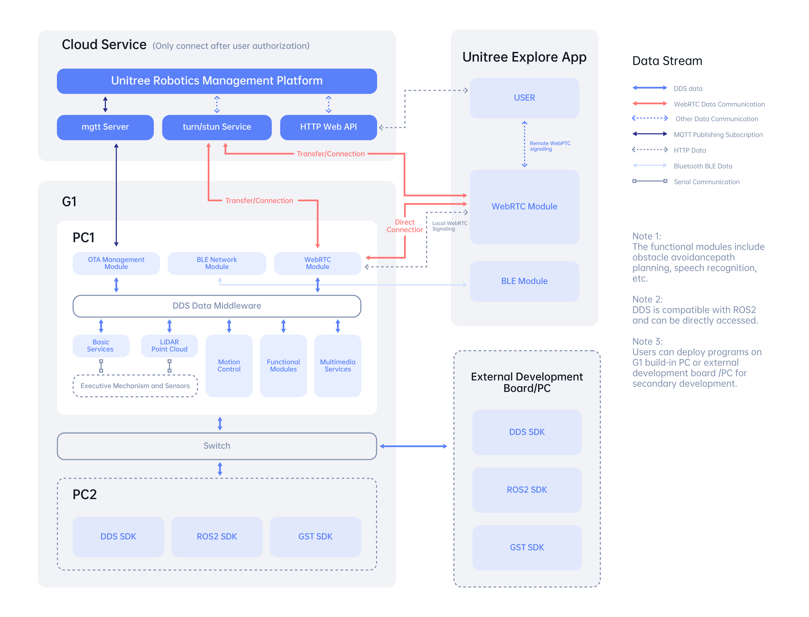
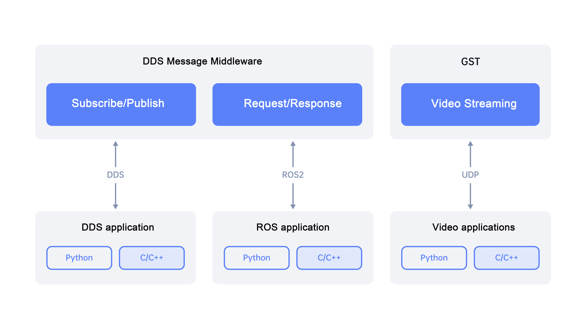
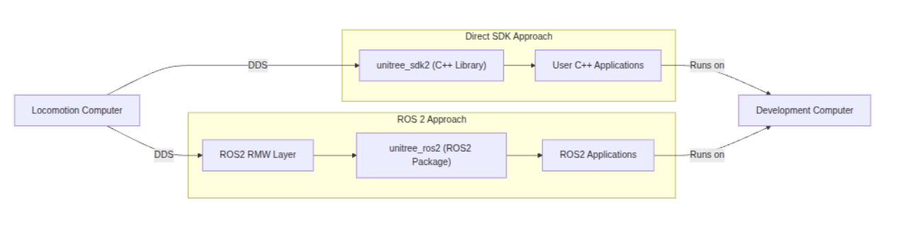

# 01 - Unitree G1 System Architecture

## Lesson Goal
Understand how the Unitree G1 fits together as a robot platform and how this repository connects a development machine to the robot through ROS 2, the Unitree SDK, and DDS middleware.

## Key Links
- Unitree product page: https://www.unitree.com/g1/
- Unitree support portal: https://support.unitree.com/
- G1 architecture description: https://support.unitree.com/home/en/G1_developer/architecture_description
- G1 SDK overview: https://support.unitree.com/home/en/G1_developer/sdk_overview
- Unitree ROS 2 repository: https://github.com/unitreerobotics/unitree_ros2
- Unitree SDK 2 repository: https://github.com/unitreerobotics/unitree_sdk2
- Repo overview: [README.md](/home/robot/ROS2/README.md)

## Core Notes
The G1 is the physical robot, but the software stack is split across multiple layers. At the lowest level, the robot hardware contains actuators, sensors, onboard controllers, and onboard compute. Above that, Unitree provides an SDK and ROS 2 integration packages so an external developer can observe state, publish commands, and build applications without working directly at the firmware level.

This repository is set up as a ROS 2 Foxy development environment. The main workflow is:

1. Use a host Ubuntu machine with Docker, NVIDIA support, and X11 forwarding.
2. Start the dev container from this repository.
3. Build `unitree_sdk2` and `unitree_ros2` inside the container.
4. Use ROS 2 nodes, topics, and launch tools from the container to work with the G1 stack.

High-level architecture to remember:

- Robot hardware layer: motors, joints, IMU, cameras and other onboard sensing.
- Unitree middleware layer: vendor SDK APIs for low-level communication and robot-specific data/control.
- ROS 2 integration layer: Unitree packages expose robot data through ROS 2 nodes, topics, messages, and tools.
- DDS transport layer: ROS 2 communication runs over DDS. This repo is configured around `rmw_cyclonedds_cpp`.
- Developer application layer: your own nodes, visualizers, scripts, and launch files run on top.

Host versus robot mindset:

- The robot is the real-time physical system.
- The host machine or container is usually where you build, inspect topics, run tools, and prototype higher-level behavior.
- ROS 2 provides the shared communication model so those pieces can talk cleanly.

For this repo specifically, the container environment matters because it standardizes dependencies and gives a repeatable place to build the Unitree ROS 2 stack. That is why the README emphasizes Docker, GPU access, `host` networking, and Cyclone DDS.

## Unitree G1 Architecture
The Unitree G1 architecture description is the best starting point for understanding how the robot platform is layered. Read it as a map of how sensing, control, onboard computation, and external development interfaces fit together.

What to focus on from the architecture page:

- The split between the physical robot system and the software interfaces exposed to developers.
- How onboard components handle robot-side computation and control.
- Where external developers connect through SDK and ROS 2 tooling instead of directly modifying low-level control internals.
- How communication flows from robot state and control channels into higher-level application code.

Practical takeaway: when we work in this repository, we are mostly operating in the external development layer. We use the provided interfaces to observe robot state, integrate with ROS 2, and build tools on top of the Unitree platform.

## SDK Overview
The SDK overview explains the developer-facing API layer that sits between your application code and the robot platform. This is the part that makes it possible to write software without implementing the robot communication stack from scratch.

What to focus on from the SDK overview:

- The SDK provides the structured access point for robot data and commands.
- It is the foundation used by higher-level integrations such as `unitree_ros2`.
- It helps bridge vendor-specific robot capabilities into workflows that can then be surfaced through ROS 2 nodes and topics.
- Understanding the SDK makes it easier to understand why this repo builds `unitree_sdk2` before using the ROS 2 packages.

Practical takeaway: if ROS 2 is the integration and application layer, the SDK is the lower-level developer interface that makes that integration possible.

## What To Understand From This Video
- Where the G1 hardware ends and the ROS 2 software layer begins.
- Why both `unitree_sdk2` and `unitree_ros2` are important.
- Why DDS and `rmw_cyclonedds_cpp` matter for communication.
- Why the host/container workflow is useful during development.

## Quick Checklist / Takeaway
- I can explain the difference between robot hardware, SDK, and ROS 2 packages.
- I know this repo is built around Unitree G1 + ROS 2 Foxy.
- I know the main communication path is robot <-> Unitree SDK/ROS 2 bridge <-> DDS <-> my ROS 2 nodes.
