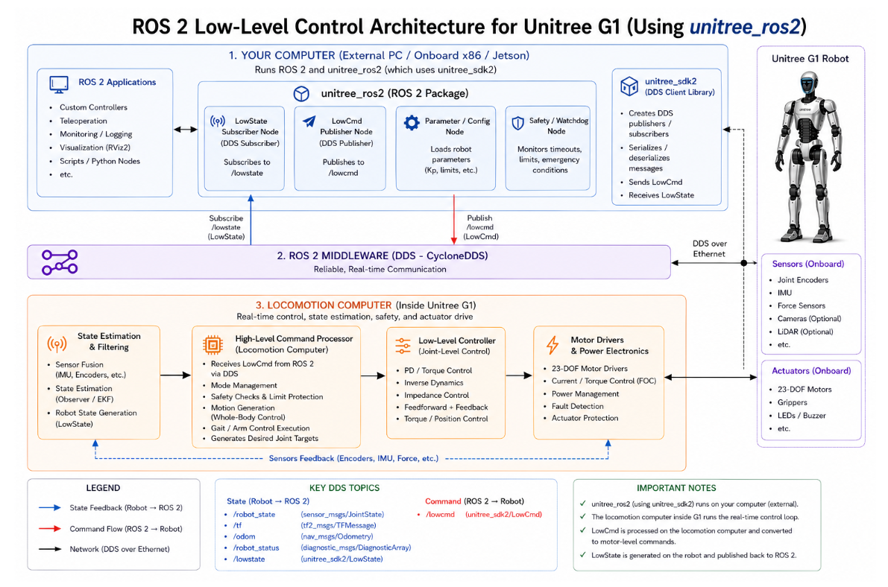

# Module 2: Unitree G1 Programming using ROS 2 and C++

## Introduction

This module introduces the concepts of controlling the Unitree G1 humanoid robot using ROS 2 and C++. The focus of this section is understanding low-level control, where developers directly command individual robot joints and actuators with precise control parameters.

Unlike high-level APIs that abstract robot behavior, low-level control gives full access to the robot’s motion system. This enables advanced robotics applications such as custom locomotion, balancing, reinforcement learning, whole-body control, and AI-based motion policies.

By the end of this module, learners will understand how low-level control works in the Unitree G1 platform, where it is used, and when it should or should not be applied.

---

# Key Links

## Unitree Robotics
- Official Website: https://www.unitree.com

## Unitree ROS 2 Packages
- GitHub Repository: https://github.com/unitreerobotics

## ROS 2 Documentation
- https://docs.ros.org

## Unitree SDK
- https://github.com/unitreerobotics/unitree_sdk2

## Unitree ROS 2 Interface
- https://github.com/unitreerobotics/unitree_ros2

---

# Notes

## List of Topics

- Introduction of Unitree G1 Control with ROS 2
- Low-Level Control of Unitree G1
- High-Level Control of Unitree G1
- Advanced Interfaces of Unitree G1
- Practice and Exercises
- Additional Resources

---

# Low-Level Control of Unitree G1

## What is Low-Level Control?

Low-level control means directly controlling the robot’s joints and motors without any abstraction layer. In this mode, the developer becomes responsible for generating the commands that drive the robot.

Instead of asking the robot to “walk” or “move forward,” you directly control each actuator by sending motor commands such as:

- Joint position
- Joint velocity
- Torque
- Stiffness gain (`Kp`)
- Damping gain (`Kd`)

This control loop usually runs at high frequency in real time to maintain stable robot behavior.

---

## Core Idea

The main concept behind low-level control is:

- Direct control of individual joints
- Sending motor-level commands
- Real-time execution
- Full ownership of robot behavior

This gives maximum flexibility but also maximum responsibility.

---

## What Actually Happens Internally?

In a typical low-level control loop:

1. The robot continuously reads joint states:
   - Position
   - Velocity
   - Torque

2. A controller computes the next action:
   - PD Controller
   - MPC Controller
   - RL Policy
   - Whole-body controller

3. Commands are sent back to the motors.

This loop repeats continuously at very high frequency.

---

# Where Low-Level Control is Used

Low-level control is commonly used in advanced robotics research and development.

## Common Use Cases

### Research and Advanced Control

Researchers use low-level interfaces for:

- Model Predictive Control (MPC)
- Reinforcement Learning (RL)
- Whole-body control systems

### Custom Locomotion

Developers can create:

- Walking controllers
- Jumping behaviors
- Running algorithms
- Dynamic balancing systems

### Precision Motion and Manipulation

Useful for:

- Manipulation tasks
- Arm coordination
- Fine motor control

### Hardware Testing and Debugging

Engineers use it to:

- Test actuators
- Validate sensors
- Tune controllers
- Analyze robot performance

### AI Policy Deployment

Policies trained in simulation can be deployed directly onto the robot using low-level interfaces.

---

# Key Characteristics

## Advantages

- Full control over robot behavior
- Extremely flexible
- Ideal for advanced robotics development
- Enables custom controller implementation

## Challenges

- Requires strong control-system knowledge
- Risk of instability
- Unsafe commands can damage hardware
- No built-in safety abstraction

---

# When to Use Low-Level Control

Use low-level control when:

- You need fine-grained control
- You are developing custom controllers
- You are working on research projects
- You need direct motor access
- You are deploying AI motion policies

---

# When NOT to Use Low-Level Control

Avoid low-level control when:

- Building simple applications
- You only need navigation or basic walking
- Safety and simplicity are priorities
- You do not need direct actuator access

In such cases, high-level APIs and controllers are usually a better choice.

---

# Important Takeaway

> Low-level control means you become the robot’s brain at the joint level.

You are responsible for:

- Reading sensor data
- Computing control outputs
- Maintaining stability
- Ensuring safety
- Generating robot motion

This is powerful, but it requires careful design and testing.

---

# Summary

In this lesson, we explored the foundations of low-level control in the Unitree G1 humanoid robot using ROS 2 and C++.

We learned:

- What low-level control means
- How motor commands are sent
- Where low-level control is used
- The benefits and risks involved
- When developers should use this approach

This knowledge forms the basis for advanced humanoid robot programming and controller development.
