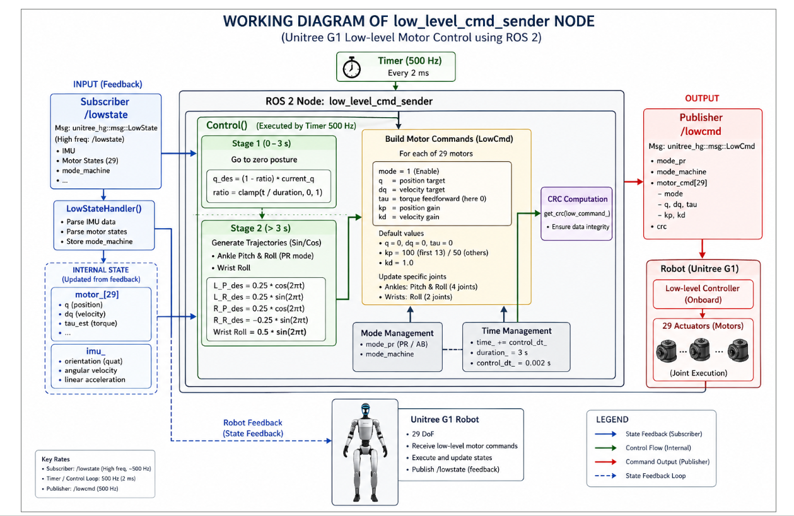

# Module Name

## Unitree G1 Low-Level Motor Control using ROS 2  
### Understanding `g1_low_level_example.cpp`

---

# Introduction

This module explains the working of the **Unitree G1 low-level motor control example** implemented in:

https://github.com/unitreerobotics/unitree_ros2/blob/master/example/src/src/g1/lowlevel/g1_low_level_example.cpp

The example demonstrates how to directly control the **29 actuators (motors)** of the Unitree G1 humanoid robot using **ROS 2** and the **Unitree SDK2 low-level interface**.

Unlike high-level motion commands such as walking or predefined actions, this example gives direct access to:

- Joint positions
- Joint velocities
- Torque commands
- PD controller gains
- Real-time motor feedback

This is one of the most important examples for understanding:

- Humanoid robot motor control
- Real-time ROS 2 communication
- Low-level actuator interfaces
- Trajectory generation
- Robot feedback loops
- Safety-critical robot programming

The node runs at **500 Hz (every 2 ms)** for real-time motor control.

---

# Key Links

## Official Repository

- https://github.com/unitreerobotics/unitree_ros2

## Example Source File

- https://github.com/unitreerobotics/unitree_ros2/blob/master/example/src/src/g1/lowlevel/g1_low_level_example.cpp

## Unitree SDK2

- https://github.com/unitreerobotics/unitree_sdk2

## ROS 2 Documentation

- https://docs.ros.org/en/foxy/index.html

---

# Understanding the Purpose of this Example

The main goal of this example is to show how to:

1. Read robot state feedback
2. Access IMU and motor data
3. Generate motor trajectories
4. Send low-level commands to each motor
5. Execute real-time control loops

This example acts as the foundation for:

- Walking controllers
- Balance control
- Reinforcement learning policies
- Whole-body control
- Motion imitation
- Custom humanoid behaviors

---

# Overall Architecture

The control pipeline follows this flow:

```text
Robot Sensors
      ↓
/lowstate Subscriber
      ↓
Parse Feedback
      ↓
Internal Robot State Update
      ↓
Control Algorithm
      ↓
Build LowCmd Message
      ↓
CRC Computation
      ↓
Publish /lowcmd
      ↓
Robot Motors Execute Motion
```



---

# ROS 2 Interfaces Used

## Subscriber

### Topic: `/lowstate`

This topic provides high-frequency feedback from the robot.

Message Type:

```cpp
unitree_hg::msg::LowState
```

The node receives:

- IMU data
- Motor states
- Joint positions
- Joint velocities
- Estimated torques
- Mode information

---

## Publisher

### Topic: `/lowcmd`

This topic sends low-level motor commands to the robot.

Message Type:

```cpp
unitree_hg::msg::LowCmd
```

The command includes:

- Position target (`q`)
- Velocity target (`dq`)
- Torque (`tau`)
- Position gain (`kp`)
- Velocity gain (`kd`)
- Motor mode

---

# Control Loop Frequency

The node uses a timer running at:

```text
500 Hz
```

Which means:

```text
Control period = 2 ms
```

This is extremely important in robotics because humanoid robots require:

- Fast feedback
- Stable motor updates
- Low latency control
- Real-time synchronization

---

# Internal Structure of the Node

The ROS 2 node is called:

```cpp
low_level_cmd_sender
```

The node contains:

- Subscriber callback
- Timer callback
- State storage
- Control logic
- Command generation
- CRC computation

---

# Stage-Based Motion Control

The example divides motion generation into two stages.

---

# Stage 1 — Initial Zero Pose Transition

## Duration

```text
0 → 3 seconds
```

The robot smoothly moves from its current posture to a safe neutral pose.

This prevents:

- Sudden jerks
- Motor shocks
- Instability
- Unsafe startup behavior

The interpolation formula used is approximately:

```cpp
q_des = (1 - ratio) * current_q
```

Where:

```cpp
ratio = clamp(t / duration, 0, 1)
```

This creates smooth motion interpolation.

---

# Stage 2 — Sinusoidal Motion Generation

After the robot reaches the neutral pose, the controller starts generating trajectories.

## Motions Generated

### Ankle Pitch & Roll

The example generates sinusoidal motion for:

- Left ankle pitch
- Left ankle roll
- Right ankle pitch
- Right ankle roll

Example trajectory:

```cpp
0.25 * cos(2πt)
```

---

## Wrist Roll Motion

The wrist joints also move using sinusoidal motion.

Example:

```cpp
0.5 * sin(2πt)
```

---

# Why Sin/Cos Trajectories are Used

Sinusoidal trajectories are commonly used because they provide:

- Smooth acceleration
- Smooth deceleration
- Continuous motion
- Easy trajectory testing
- Stable motor excitation

These are ideal for:

- Joint testing
- Calibration
- Motor validation
- Controller verification

---

# Low-Level Motor Command Structure

For each motor, the controller fills a command structure.

---

# Important Parameters

## 1. Motor Mode

```cpp
mode = 1
```

Enables the actuator.

---

## 2. Position Target

```cpp
q
```

Desired joint position.

---

## 3. Velocity Target

```cpp
dq
```

Desired joint velocity.

---

## 4. Torque Feedforward

```cpp
tau
```

Additional torque command.

Usually set to zero in this example.

---

## 5. Position Gain

```cpp
kp
```

Controls stiffness.

Higher values:

- More aggressive tracking
- Faster response
- Less compliance

---

## 6. Velocity Gain

```cpp
kd
```

Controls damping.

Higher values:

- More stability
- Reduced oscillation
- Smoother motion

---

# PD Controller Concept

The example mainly uses a PD controller.

Control concept:

```text
Torque = kp(position_error) + kd(velocity_error)
```

This is one of the most fundamental control techniques in robotics.

---

# Default Gain Values

The example uses values similar to:

```cpp
kp = 100 (first joints)
kp = 50  (other joints)
kd = 1.0
```

These gains determine how strongly the robot tracks target motion.

---

# Internal State Storage

The node stores robot feedback internally.

---

# Motor State Array

```cpp
motor_[29]
```

Stores:

- Joint position
- Joint velocity
- Estimated torque

---

# IMU Data

The IMU stores:

- Orientation quaternion
- Angular velocity
- Linear acceleration

This information is essential for:

- Balance control
- State estimation
- Walking algorithms
- Whole-body control

---

# Mode Management

The example handles robot modes such as:

```cpp
mode_pr
mode_machine
```

These define operational states of the robot.

Examples include:

- PR mode
- AB mode
- Low-level operation states

---

# CRC Computation

Before publishing commands, the example computes:

```cpp
CRC
```

Purpose:

- Data integrity validation
- Communication safety
- Packet verification

Without proper CRC values, the robot may reject commands.

---

# Real-Time Feedback Loop

The robot continuously publishes:

```text
/lowstate
```

The node continuously sends:

```text
/lowcmd
```

This creates a closed-loop control system.

```text
Robot → Feedback → Controller → Commands → Robot
```

This loop runs every 2 ms.

---

# Why This Example is Important

This example is the foundation for advanced humanoid robotics applications.

It teaches:

- Real-time robotics programming
- ROS 2 middleware communication
- Humanoid actuator control
- Joint trajectory generation
- Motor feedback processing
- Low-level robot architecture

Almost every advanced controller eventually builds on concepts shown here.

---

# Important Safety Notes

Low-level control directly commands actuators.

Incorrect values can cause:

- Robot falls
- Motor damage
- Unsafe motion
- Hardware stress

Always:

- Start with small trajectories
- Use safe gain values
- Test in simulation first
- Keep emergency stop ready

---

# Summary

The `g1_low_level_example.cpp` file demonstrates the complete low-level control pipeline of the Unitree G1 humanoid robot using ROS 2.

The example shows how to:

- Receive robot feedback
- Process motor states
- Generate trajectories
- Create motor commands
- Apply PD control
- Publish low-level actuator commands
- Execute real-time humanoid control loops

Understanding this example is critical for anyone developing advanced humanoid robot applications on the Unitree G1 platform.
