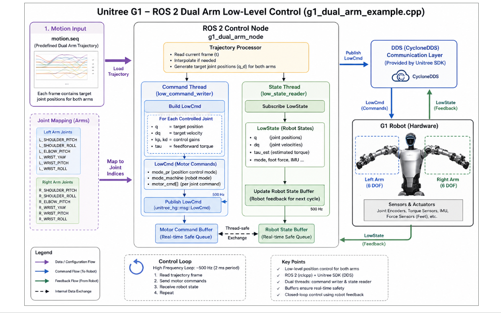

# Module Name

## Unitree G1 Dual Arm Control using ROS 2  
### Understanding `g1_dual_arm_example.cpp`

---

# Introduction

This module explains the working of the **Unitree G1 dual arm low-level control example** implemented in:

https://github.com/unitreerobotics/unitree_ros2/blob/master/example/src/src/g1/lowlevel/g1_dual_arm_example.cpp

The example demonstrates how to directly control the **left and right robotic arms** of the Unitree G1 humanoid robot using **ROS 2** and the **Unitree SDK2 low-level motor interface**.

This example is important because it introduces:

- Dual-arm coordinated control
- Multi-joint trajectory execution
- Real-time humanoid manipulation
- Low-level actuator programming
- Arm joint synchronization
- PD-based motor control
- Motion interpolation
- Real-time feedback loops

The program performs smooth arm initialization followed by coordinated arm motion using low-level joint commands.

This example forms the foundation for advanced humanoid manipulation applications such as:

- Teleoperation
- Object manipulation
- Human-robot interaction
- Gesture generation
- Whole-body control
- AI-based manipulation systems

---

# Key Links

## Official Repository

- https://github.com/unitreerobotics/unitree_ros2

## Example Source File

- https://github.com/unitreerobotics/unitree_ros2/blob/master/example/src/src/g1/lowlevel/g1_dual_arm_example.cpp

## Unitree SDK2

- https://github.com/unitreerobotics/unitree_sdk2

## Unitree G1 Development Guide

- https://support.unitree.com/home/en/G1_developer

## ROS 2 Documentation

- https://docs.ros.org/en/foxy/index.html

---

# Purpose of this Example

The main objective of this example is to demonstrate:

1. Low-level arm motor control
2. Real-time dual-arm coordination
3. Joint trajectory execution
4. Feedback-driven control loops
5. Multi-joint synchronization
6. Smooth motion transitions
7. Arm posture control

This example acts as a starting point for:

- Manipulation research
- Humanoid arm control
- Reinforcement learning
- Motion imitation
- Teleoperation systems
- Whole-body humanoid control

---

# Understanding the G1 Arm Structure

The Unitree G1 humanoid robot contains multiple arm joints.

Each arm typically contains:

- Shoulder Pitch
- Shoulder Roll
- Shoulder Yaw
- Elbow Pitch
- Wrist joints

The EDU version may additionally include dexterous hand joints.

The example focuses on coordinated motion control of these arm joints.

---

# Overall Control Pipeline

The control architecture follows this flow:

```text
Robot Sensors
      ↓
/lowstate Subscriber
      ↓
Joint State Parsing
      ↓
Internal Arm State Update
      ↓
Trajectory / Position Generator
      ↓
Build LowCmd Message
      ↓
CRC Calculation
      ↓
Publish /lowcmd
      ↓
Dual Arm Motion Execution
```



---

# ROS 2 Interfaces Used

## Subscriber

### Topic

```text
/lowstate
```

Message Type:

```cpp
unitree_hg::msg::LowState
```

The node receives:

- Joint positions
- Joint velocities
- Motor torque estimates
- IMU feedback
- Robot mode information

This feedback is continuously used by the controller.

---

## Publisher

### Topic

```text
/lowcmd
```

Message Type:

```cpp
unitree_hg::msg::LowCmd
```

This topic sends:

- Position targets
- Velocity targets
- Torque commands
- PD gains
- Motor enable commands

to the robot actuators.

---

# Real-Time Control Frequency

The example operates using a high-frequency control loop.

Typical frequency:

```text
500 Hz
```

Which means:

```text
Control period = 2 ms
```

High-frequency control is critical for:

- Smooth arm movement
- Stable tracking
- Low latency response
- Accurate manipulation
- Real-time humanoid control

---

# Internal Node Architecture

The ROS 2 node manages:

- DDS communication
- State feedback parsing
- Joint command generation
- Timer-based control execution
- CRC computation
- Motor synchronization

The node continuously exchanges commands and feedback with the robot in real time.

---

# Motion Execution Stages

The example generally operates in multiple stages.

---

# Stage 1 — Safe Initialization

At startup, the robot arms may be in arbitrary positions.

The controller first moves the arms smoothly into a neutral pose.

Purpose:

- Avoid sudden movement
- Protect arm actuators
- Prevent unstable motion
- Enable smooth startup

Typical interpolation concept:

```cpp
q_target = (1 - ratio) * current_q
```

Where:

```cpp
ratio = clamp(time / duration, 0, 1)
```

This creates smooth posture transitions.

---

# Stage 2 — Dual Arm Motion Execution

After initialization, the controller sends coordinated position commands to both robot arms.

The example demonstrates:

- Multi-joint arm coordination
- Synchronized left/right arm control
- Smooth posture transitions
- Real-time actuator communication
- Continuous low-level motor updates

The controller continuously updates desired joint targets and publishes low-level commands through the real-time control loop.

This allows the robot to execute stable and coordinated dual-arm motion.

---

# Smooth Joint Motion Control

The example focuses on smooth and stable arm motion using:

- Gradual joint interpolation
- Real-time position updates
- PD-based actuator tracking
- Continuous feedback correction

Smooth motion execution is critical in humanoid manipulation because sudden arm movements can:

- Destabilize the robot
- Stress actuators
- Create unsafe motion
- Reduce tracking accuracy

---

# Dual Arm Synchronization

One important concept demonstrated in this example is:

```text
Synchronized multi-joint control
```

The controller ensures:

- Both arms move together
- Joint timing remains aligned
- Motion remains smooth
- Feedback remains synchronized

This is extremely important in:

- Manipulation tasks
- Human-like motion generation
- Object carrying
- Coordinated arm gestures

---

# Low-Level Motor Command Structure

Each actuator command contains:

```cpp
mode
q
dq
tau
kp
kd
```

The controller fills these parameters for every arm motor.

---

# Important Parameters

## 1. mode

```cpp
mode = 1
```

Enables the actuator.

---

## 2. q

Desired joint position.

---

## 3. dq

Desired joint velocity.

---

## 4. tau

Feedforward torque command.

Usually set to zero in this example.

---

## 5. kp

Position gain.

Controls:

- Joint stiffness
- Tracking strength
- Motion responsiveness

Higher values produce stronger tracking.

---

## 6. kd

Velocity gain.

Controls:

- Motion damping
- Oscillation suppression
- Smoothness

Higher values improve stability.

---

# PD Controller Principle

The example primarily uses a PD controller.

Basic concept:

```text
Torque = kp(position_error) + kd(velocity_error)
```

This is one of the most widely used control techniques in robotics.

---

# Arm Joint State Storage

The controller stores joint feedback internally.

Example structure:

```cpp
motor_[29]
```

This stores:

- Joint positions
- Joint velocities
- Estimated torque values

The controller continuously updates this data from robot feedback.

---

# IMU Feedback

The robot IMU provides:

- Orientation quaternion
- Angular velocity
- Linear acceleration

Although this example mainly focuses on arm control, IMU data remains important for:

- Whole-body balance
- Stability monitoring
- Future whole-body controllers

---

# CRC Computation

Before publishing commands, the example computes:

```cpp
CRC
```

Purpose:

- Data integrity verification
- Communication reliability
- Packet validation

Without correct CRC values, commands may be rejected by the robot.

---

# Real-Time Feedback Loop

The control system continuously operates as:

```text
Robot → Feedback → Controller → Commands → Robot
```

This loop executes every:

```text
2 ms
```

This is the core principle behind real-time humanoid robot control.

---

# Relation to Advanced Manipulation

This example is foundational for advanced humanoid manipulation systems.

The same concepts are used in:

- Teleoperation systems
- AI motion imitation
- Object manipulation
- Vision-guided robotics
- Reinforcement learning policies
- Whole-body loco-manipulation systems

---

# Running the Example

Typical build process:

```bash
git clone https://github.com/unitreerobotics/unitree_sdk2.git

cd unitree_sdk2

cmake -B build

cmake --build build
```

Run the example:

```bash
./build/bin/g1_dual_arm_example <network_interface>
```

Example:

```bash
./build/bin/g1_dual_arm_example enp3s0
```

The network interface must correspond to the robot communication interface.

---

# Important Safety Notes

This example directly controls arm actuators.

Incorrect commands may cause:

- Sudden arm movement
- Robot instability
- Hardware damage
- Unsafe operation

Always:

- Support the robot safely
- Start with small movements
- Use conservative gain values
- Keep emergency stop accessible

---

# Why This Example is Important

This example introduces several critical humanoid robotics concepts:

- Real-time dual-arm coordination
- Multi-joint trajectory execution
- Low-level actuator programming
- Closed-loop control systems
- Manipulation-oriented robotics
- ROS 2 humanoid communication

Most advanced humanoid manipulation systems build upon these same principles.

---


# Summary

The `g1_dual_arm_example.cpp` file demonstrates how to perform coordinated dual-arm low-level control on the Unitree G1 humanoid robot using ROS 2 and Unitree SDK2.

The example teaches:

- Real-time actuator communication
- Dual-arm synchronization
- Multi-joint motion execution
- PD-based motor control
- Feedback-driven motion control
- Closed-loop humanoid manipulation
- Real-time robotic arm programming

Understanding this example is an important step toward advanced humanoid manipulation and whole-body robotics development on the Unitree G1 platform.
