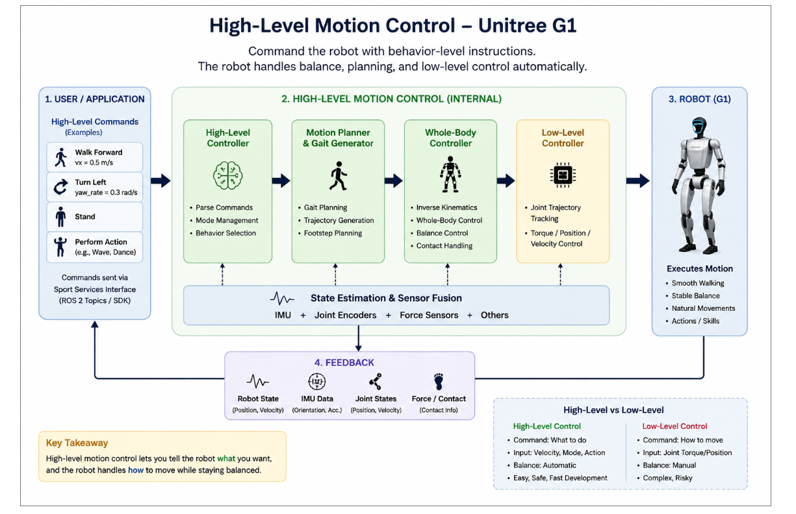
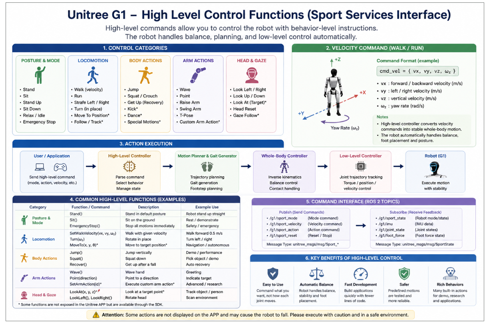

# Module Name

## Unitree G1 High-Level Motion Control using ROS 2  
### Understanding the Sport Services Interface

---

# Introduction

This module explains the **high-level motion control architecture** of the Unitree G1 humanoid robot using the **Sport Services Interface**.

Unlike low-level control, where developers directly command motors and joint torques, high-level control allows developers to send **behavior-level commands** such as:

- Walk forward
- Turn left/right
- Stand
- Sit
- Wave hand
- Perform actions

The robot internally handles:

- Balance control
- Gait generation
- Motion planning
- Footstep planning
- Whole-body coordination
- Low-level motor execution

This makes high-level control:

- Easier
- Safer
- Faster for development

The developer focuses on:

```text
"What the robot should do"
```

instead of:

```text
"How each motor should move"
```

---

# Key Links

## Official Repository

- https://github.com/unitreerobotics/unitree_ros2

## Unitree SDK2

- https://github.com/unitreerobotics/unitree_sdk2

## Unitree G1 Documentation

- https://support.unitree.com/home/en/G1_developer

## ROS 2 Documentation

- https://docs.ros.org/en/foxy/index.html

---

# What is High-Level Control?

High-level control provides a simplified interface for commanding humanoid robot behaviors.



Instead of controlling:

- Joint angles
- Motor torques
- PD gains

the developer sends commands such as:

```text
Walk forward at 0.5 m/s
```

or

```text
Turn left
```

The robot automatically performs:

- Gait planning
- Stability control
- Balance maintenance
- Motion generation
- Footstep placement

---

# High-Level vs Low-Level Control

| High-Level Control | Low-Level Control |
|---|---|
| Command what to do | Command how to move |
| Easy to use | Complex |
| Automatic balancing | Manual balancing |
| Behavior-oriented | Joint-oriented |
| Safer | Riskier |
| Faster development | More flexible |

---

# High-Level Control Categories

The G1 Sport Services Interface provides multiple categories of commands.

---

# 1. Posture & Mode Control

These commands control the robot posture and operational state.

Examples:

- Stand
- Sit
- Stand Up
- Sit Down
- Relax / Idle
- Emergency Stop

Typical use cases:

- Robot initialization
- Safe operation
- Demo setup
- Recovery procedures

---

# 2. Locomotion Control

These commands control robot movement.

Examples:

- Walk
- Run
- Turn
- Strafe left/right
- Move to target position
- Follow target

Typical applications:

- Navigation
- Autonomous movement
- Human following
- Dynamic locomotion

---

# 3. Body Actions

These commands trigger predefined body motions.

Examples:

- Jump
- Squat
- Recovery motion
- Kick
- Dance
- Demo actions

These actions are internally handled by the robot motion engine.

---

# 4. Arm Actions

These commands control upper-body gestures and arm motion.

Examples:

- Wave
- Point
- Raise arm
- Swing arm
- T-pose
- Custom arm actions

Applications include:

- Human-robot interaction
- Demonstrations
- Gesture generation
- Manipulation research

---

# 5. Head & Gaze Control

These commands control head orientation and visual direction.

Examples:

- Look left/right
- Look up/down
- Head reset
- Gaze tracking

Applications:

- Human interaction
- Vision systems
- Attention control
- Object tracking

---

# Velocity Command Interface

One of the most important high-level commands is velocity control.

Typical command format:

```text
cmd_vel = { vx, vy, vz, ωz }
```

Where:

| Parameter | Description |
|---|---|
| `vx` | Forward/backward velocity |
| `vy` | Left/right velocity |
| `vz` | Vertical velocity |
| `ωz` | Yaw rotation rate |

Example:

```text
vx = 0.5 m/s
```

This commands the robot to walk forward.

---

# Internal High-Level Motion Pipeline

The robot internally converts high-level commands into stable whole-body motion.

The architecture follows this pipeline:

```text
User Command
      ↓
High-Level Controller
      ↓
Motion Planner & Gait Generator
      ↓
Whole-Body Controller
      ↓
Low-Level Controller
      ↓
Robot Motion Execution
```



---

# High-Level Controller

The high-level controller is responsible for:

- Parsing commands
- Managing behavior states
- Selecting motion modes
- Command interpretation

Example responsibilities:

- Stand mode
- Walking mode
- Action execution
- Mode switching

---

# Motion Planner & Gait Generator

This subsystem generates stable locomotion trajectories.

Responsibilities include:

- Gait generation
- Footstep planning
- Walking trajectory generation
- Motion interpolation

The planner determines:

- Where the feet should move
- Step timing
- Walking stability

---

# Whole-Body Controller

The whole-body controller manages full robot coordination.

Responsibilities include:

- Inverse kinematics
- Whole-body balancing
- Contact handling
- Dynamic stability

This layer ensures the robot remains balanced while executing motions.

---

# Low-Level Controller

The low-level controller converts planned trajectories into actuator commands.

Responsibilities include:

- Joint trajectory tracking
- Position control
- Velocity control
- Torque control

This layer directly communicates with robot actuators.

---

# State Estimation & Sensor Fusion

The robot continuously processes sensor data.

Sensors include:

- IMU
- Joint encoders
- Force sensors
- Contact sensors

This data is fused to estimate:

- Robot orientation
- Velocity
- Joint states
- Ground contact
- Stability state

---

# Feedback System

The robot continuously publishes feedback information.

Typical feedback includes:

- Robot state
- IMU data
- Joint states
- Foot contact information
- Velocity estimation

This creates a closed-loop motion system.

---

# ROS 2 Communication Topics

Typical Sport Service topics include:

---

# Publish Topics

These topics send commands to the robot.

Examples:

```text
/g1/sport_mode
/g1/sport_velocity
/g1/sport_action
/g1/sport_reset
```

---

# Subscribe Topics

These topics receive robot feedback.

Examples:

```text
/g1/sport_state
/g1/imu
/g1/joint_state
/g1/foot_force
```

---

# Action Execution Pipeline

A typical command execution flow looks like:

```text
Application
      ↓
ROS 2 Topic Command
      ↓
High-Level Controller
      ↓
Motion Planning
      ↓
Whole-Body Coordination
      ↓
Low-Level Motor Control
      ↓
Robot Executes Motion
```

---

# Advantages of High-Level Control

High-level control provides several major advantages.

---

# 1. Easy Development

Developers can build applications quickly without handling:

- Joint control
- Balance algorithms
- Gait planning

This significantly reduces complexity.

---

# 2. Automatic Balance

The robot internally maintains:

- Dynamic balance
- Foot placement
- Stability control

The user does not need to manually stabilize the robot.

---

# 3. Faster Prototyping

Applications can be developed rapidly using:

- Predefined actions
- Velocity commands
- Motion APIs

---

# 4. Safer Operation

The internal controllers are tested and optimized by Unitree.

This reduces risks associated with direct actuator programming.

---

# 5. Rich Built-In Behaviors

The system provides many built-in capabilities including:

- Walking
- Turning
- Gestures
- Recovery behaviors
- Action sequences

---

# Real-World Applications

High-level control is widely used in:

- Research robotics
- Demonstrations
- Human-robot interaction
- AI applications
- Navigation systems
- Teleoperation
- Service robotics

---

# Important Safety Notes

Although high-level control is safer than low-level control, incorrect usage may still cause:

- Falls
- Instability
- Collisions
- Unsafe actions

Always:

- Operate in open environments
- Start with low velocities
- Keep emergency stop ready
- Test gradually


---

# Summary

The Unitree G1 high-level control system allows developers to command humanoid robot behaviors using simplified behavior-level instructions.

Instead of directly controlling motors, developers can issue commands such as:

- Walk
- Turn
- Stand
- Wave
- Perform actions

The robot internally handles:

- Motion planning
- Balance control
- Gait generation
- Whole-body coordination
- Low-level motor execution

This architecture enables:

- Faster development
- Safer operation
- Easier humanoid programming
- Rich robot behaviors

Understanding high-level control is essential before moving into advanced humanoid robotics applications and autonomous behavior development.
