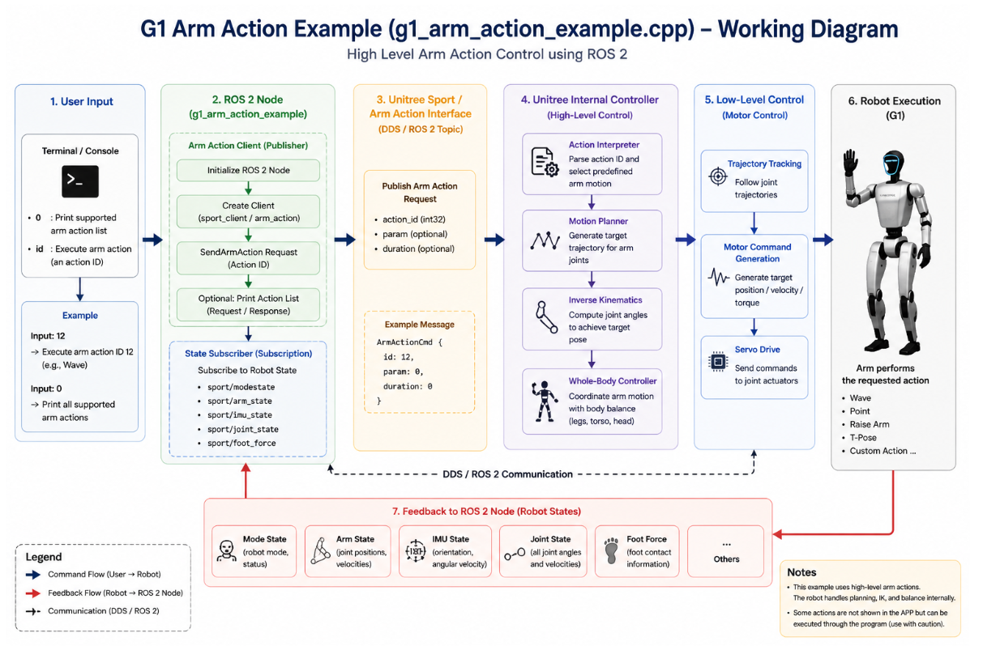

# Module Name

## Unitree G1 High-Level Arm Action Control using ROS 2  
### Understanding `g1_arm_action_example.cpp`

---

# Introduction

This module explains the working of the **Unitree G1 high-level arm action example** implemented in:

[g1_arm_action_example.cpp](https://github.com/unitreerobotics/unitree_ros2/blob/master/example/src/src/g1/high_level/g1_arm_action_example.cpp?utm_source=chatgpt.com)

The example demonstrates how to trigger predefined **high-level arm actions** on the Unitree G1 humanoid robot using ROS 2 and the Unitree Sport Services Interface.

Unlike low-level control, where developers directly command:

- Joint positions
- Motor torques
- PD gains

this example allows the user to execute complete arm behaviors using a simple action ID.

Examples include:

- Wave hand
- Raise arm
- Point gesture
- T-pose
- Custom arm actions

The robot internally handles:

- Motion planning
- Inverse kinematics
- Whole-body coordination
- Joint trajectory generation
- Balance control
- Low-level motor execution

This makes high-level action control:

- Easier
- Safer
- Faster to develop

---

# Key Links

## Official Repository

- [Unitree ROS 2 Repository](https://github.com/unitreerobotics/unitree_ros2?utm_source=chatgpt.com)

## Example Source File

- [g1_arm_action_example.cpp](https://github.com/unitreerobotics/unitree_ros2/blob/master/example/src/src/g1/high_level/g1_arm_action_example.cpp?utm_source=chatgpt.com)

## Unitree SDK2

- [Unitree SDK2 Repository](https://github.com/unitreerobotics/unitree_sdk2?utm_source=chatgpt.com)

## Unitree G1 Documentation

- [Unitree G1 Developer Docs](https://support.unitree.com/home/en/G1_developer?utm_source=chatgpt.com)

## ROS 2 Documentation

- [ROS 2 Documentation](https://docs.ros.org/en/foxy/index.html?utm_source=chatgpt.com)

---

# Purpose of this Example

The main objective of this example is to demonstrate:

1. High-level arm action triggering
2. ROS 2 command publishing
3. Action-based humanoid control
4. Robot state monitoring
5. DDS/ROS 2 communication
6. High-level behavior execution

This example serves as a foundation for:

- Gesture generation
- Human-robot interaction
- Teleoperation
- AI behavior systems
- Demonstration applications
- Service robotics

---

# What is High-Level Arm Action Control?

High-level arm action control allows developers to command robot behaviors using predefined action IDs.

Instead of manually controlling each arm joint, the user simply sends:

```text
Action ID → Execute predefined behavior
```

The robot automatically handles:

- Motion generation
- Trajectory planning
- Arm coordination
- Inverse kinematics
- Stability management

This significantly simplifies humanoid programming.

---

# Overall System Architecture

The action execution pipeline follows this flow:

```text
User Input
      ↓
ROS 2 Node
      ↓
Sport / Arm Action Interface
      ↓
Unitree Internal Controller
      ↓
Low-Level Motor Control
      ↓
Robot Executes Action
```

Meanwhile, robot feedback continuously returns to the ROS 2 node.



---

# User Input

The example accepts simple terminal input.

Example:

```text
Input: 12
```

This executes a predefined arm action.

Example:

```text
Input: 0
```

This prints the supported action list.

The interface is intentionally simple to demonstrate high-level command execution.

---

# ROS 2 Node Structure

The ROS 2 node acts as the application interface between the user and the robot.

The node performs:

- ROS 2 initialization
- Publisher creation
- Action command publishing
- State subscription
- Feedback monitoring

The node communicates using DDS/ROS 2 topics.

---

# Arm Action Client

The example creates an arm action client responsible for sending commands.

Responsibilities include:

- Creating command messages
- Sending action requests
- Managing communication
- Triggering behaviors

Typical workflow:

```text
Initialize Node
      ↓
Create Client
      ↓
Send Action Request
      ↓
Robot Executes Motion
```

---

# Sport / Arm Action Interface

The command is published to the Unitree Sport Services Interface.

This interface provides high-level behavior APIs for the robot.

The command message typically contains:

```cpp
ArmActionCmd {
    id
    param
    duration
}
```

---

# Important Parameters

## 1. id

Specifies the predefined arm action.

Example:

```text
12 → Wave action
```

Different IDs correspond to different behaviors.

---

## 2. param

Optional parameter for configuring behavior execution.

Some actions may use this for:

- Motion amplitude
- Speed
- Action variation

---

## 3. duration

Optional execution duration.

Controls how long the action should run.

---

# Internal Unitree Controller

After receiving the command, the robot internally processes the action.

This stage is fully automatic.

---

# Action Interpreter

The interpreter:

- Parses the action ID
- Selects the predefined behavior
- Loads motion definitions

Example behaviors:

- Wave
- Point
- Raise arm
- T-pose
- Gesture actions

---

# Motion Planner

The motion planner generates smooth trajectories for the arm joints.

Responsibilities include:

- Trajectory generation
- Motion timing
- Joint coordination
- Transition smoothing

The planner ensures the movement remains stable and natural.

---

# Inverse Kinematics

The inverse kinematics system computes joint angles required to achieve the target arm pose.

Responsibilities include:

- End-effector positioning
- Joint angle computation
- Reachability handling
- Pose solving

This allows the robot to perform human-like arm motion.

---

# Whole-Body Controller

The whole-body controller coordinates:

- Arms
- Torso
- Balance
- Body posture

This ensures the robot remains stable during arm movement.

Humanoid robots require whole-body coordination because upper-body motion affects balance.

---

# Low-Level Motor Control

After planning is complete, the robot converts trajectories into low-level motor commands.

This layer handles:

- Joint trajectory tracking
- Position control
- Velocity control
- Torque control

The developer does not directly interact with this layer in high-level mode.

---

# Robot Execution

Finally, the robot executes the requested arm behavior.

Examples include:

- Wave
- Point
- Raise arm
- T-pose
- Custom motions

The motion is executed smoothly using the internal motion stack.

---

# Feedback to ROS 2 Node

The robot continuously publishes feedback data back to the ROS 2 node.

This creates a closed-loop system.

---

# Feedback Topics

The node subscribes to multiple robot state topics.

Examples include:

```text
/sport/modestate
/sport/arm_state
/sport/imu_state
/sport/joint_state
/sport/foot_force
```

---

# Feedback Information

The feedback contains:

- Robot mode state
- Arm joint positions
- Joint velocities
- IMU orientation
- Angular velocity
- Foot contact information

This information can be used for:

- Monitoring
- Logging
- Visualization
- AI applications
- State estimation

---

# DDS / ROS 2 Communication

The system uses DDS as the communication middleware.

DDS provides:

- Real-time communication
- Low latency
- Reliable message transport
- Scalable distributed communication

ROS 2 internally uses DDS for robot communication. :contentReference[oaicite:6]{index=6}

---

# Why High-Level Arm Actions are Useful

High-level actions significantly simplify humanoid robot programming.

Advantages include:

- No direct motor programming
- Automatic balance handling
- Fast behavior development
- Easier integration
- Safer operation
- Reusable behaviors

This is extremely useful for:

- Research
- Demos
- Human interaction
- AI applications

---

# Real-Time Closed-Loop System

The complete system operates as:

```text
User Command
      ↓
ROS 2 Command
      ↓
Motion Planning
      ↓
Low-Level Control
      ↓
Robot Motion
      ↓
Feedback to ROS 2
```

This creates a continuous real-time feedback loop.

---


The robot must be connected through the correct DDS/ROS 2 network configuration.

---

# Important Safety Notes

Although this example uses high-level control, improper use may still cause:

- Unexpected motion
- Balance instability
- Collisions
- Unsafe arm movement

Always:

- Operate in a safe environment
- Keep emergency stop ready
- Start with simple actions
- Maintain safe distance

Some actions may not be exposed in the mobile APP but can still be triggered programmatically. :contentReference[oaicite:7]{index=7}

---

# Why This Example is Important

This example introduces several important humanoid robotics concepts:

- High-level behavior control
- Action-based programming
- ROS 2 humanoid interfaces
- Motion planning pipelines
- Whole-body coordination
- Gesture execution
- Real-time feedback systems

These concepts are foundational for advanced humanoid AI systems.

---

# Summary

The `g1_arm_action_example.cpp` file demonstrates how to execute predefined high-level arm actions on the Unitree G1 humanoid robot using ROS 2 and the Unitree Sport Services Interface.

The example teaches:

- High-level humanoid behavior control
- ROS 2 command communication
- Action-based robot programming
- Motion planning architecture
- Whole-body coordination
- Feedback-driven humanoid systems

Instead of manually controlling joints and motors, the user simply sends an action ID and the robot internally performs:

- Motion planning
- Inverse kinematics
- Balance control
- Trajectory execution
- Low-level motor coordination

Understanding this example is an important step toward advanced humanoid interaction, manipulation, and AI-driven robot behavior development.
