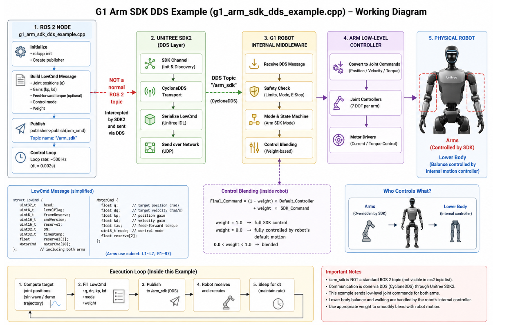

# Module Name

## Unitree G1 Arm SDK DDS Control using ROS 2  
### Understanding `g1_arm_sdk_dds_example.cpp`

---

# Introduction

This module explains the working of the **Unitree G1 Arm SDK DDS example** implemented in:

https://github.com/unitreerobotics/unitree_ros2/blob/master/example/src/src/g1/high_level/g1_arm_sdk_dds_example.cpp

The example demonstrates how to directly control the **G1 robot arms** using the **Unitree SDK2 DDS communication interface** instead of standard ROS 2 topics.

This example is important because it introduces:

- DDS-based robot communication
- Direct SDK arm control
- Low-level arm joint command generation
- Hybrid humanoid control
- Control blending
- Real-time arm trajectory execution
- Partial-body SDK override

Unlike standard high-level motion control, this example allows developers to directly control the robot arms while the lower body continues to be stabilized by the robot’s internal controller.

This creates a hybrid control architecture:

```text
Upper Body → Controlled by SDK
Lower Body → Controlled internally by robot
```

The example acts as an important bridge between:

- High-level behavior control
- Low-level actuator programming
- Whole-body humanoid coordination

---

# Key Links

## Official Repository

- https://github.com/unitreerobotics/unitree_ros2

## Example Source File

- https://github.com/unitreerobotics/unitree_ros2/blob/master/example/src/src/g1/high_level/g1_arm_sdk_dds_example.cpp

## Unitree SDK2

- https://github.com/unitreerobotics/unitree_sdk2

## CycloneDDS

- https://cyclonedds.io/

## ROS 2 Documentation

- https://docs.ros.org/en/foxy/index.html

---

# Purpose of this Example

The main objective of this example is to demonstrate:

1. DDS-based SDK communication
2. Direct arm joint control
3. Low-level arm command generation
4. Real-time trajectory execution
5. Hybrid humanoid control
6. Control blending with internal controllers

This example is commonly used for:

- Humanoid arm research
- Teleoperation
- AI motion control
- Manipulation research
- Learning low-level humanoid control
- Custom arm trajectory execution

---

# What Makes this Example Different?

Most ROS 2 examples use standard ROS topics.

This example is different because it uses:

```text
DDS SDK communication directly
```

instead of traditional ROS topic publishing.

The communication is performed through:

```text
/arm_sdk
```

This is:

- NOT a standard ROS 2 topic
- NOT visible in `ros2 topic list`
- Managed internally by Unitree SDK2
- Transmitted using CycloneDDS

---

# Overall Architecture

The control pipeline follows this structure:

```text
ROS 2 Node
      ↓
Unitree SDK2 DDS Layer
      ↓
G1 Robot Internal Middleware
      ↓
Arm Low-Level Controller
      ↓
Physical Robot Arms
```

Meanwhile, the lower body remains internally stabilized by the robot motion controller.



---

# ROS 2 Node Structure

The example starts by initializing a ROS 2 node.

Responsibilities include:

- `rclcpp` initialization
- Publisher creation
- Command generation
- Real-time control loop execution

The node continuously builds and sends arm command messages.

---

# LowCmd Message Generation

The example creates a `LowCmd` structure for arm control.

The command contains:

```cpp
q
dq
kp
kd
tau
mode
weight
```

These values define how the robot arm joints should move.

---

# Important Parameters

## 1. q

Desired joint position.

Unit:

```text
Radians
```

Defines target arm posture.

---

## 2. dq

Desired joint velocity.

Defines motion speed.

---

## 3. kp

Position gain.

Controls:

- Joint stiffness
- Tracking strength
- Motion responsiveness

Higher values increase tracking accuracy.

---

## 4. kd

Velocity gain.

Controls:

- Damping
- Stability
- Oscillation reduction

Higher values improve smoothness.

---

## 5. tau

Feedforward torque.

Optional torque assistance.

Usually set to zero in simple examples.

---

## 6. mode

Motor control mode.

Enables actuator operation.

---

## 7. weight

One of the most important parameters in this example.

Controls blending between:

- SDK arm control
- Robot internal controller

---

# Control Blending Concept

The robot internally blends SDK commands with the default controller.

Conceptually:

```text
Final_Command =
(1 - weight) × Internal_Controller
+
weight × SDK_Command
```

---

# Weight Behavior

## weight = 1.0

```text
Full SDK control
```

The SDK completely controls the robot arms.

---

## weight = 0.0

```text
Internal robot control
```

The robot ignores SDK commands.

---

## 0 < weight < 1

```text
Blended control
```

Both controllers contribute to final motion.

This allows smooth transitions and safer operation.

---

# Unitree SDK2 DDS Layer

The SDK2 layer manages:

- DDS communication
- Topic discovery
- Message serialization
- UDP transport

Internally it uses:

```text
CycloneDDS
```

for real-time robot communication.

---

# CycloneDDS Communication

CycloneDDS provides:

- Real-time messaging
- Low latency
- Reliable transport
- Distributed communication

The SDK serializes `LowCmd` messages and transmits them directly to the robot middleware.

---

# Robot Internal Middleware

Inside the robot, the middleware performs:

- DDS message reception
- Safety checking
- Mode management
- Control blending
- Command routing

This acts as a safety and coordination layer before commands reach the actuators.

---

# Safety Checks

The robot validates:

- Motion limits
- Control modes
- Emergency stop status
- Joint safety ranges

Unsafe commands may be rejected internally.

---

# Arm Low-Level Controller

After validation, the commands are sent to the arm low-level controller.

Responsibilities include:

- Joint trajectory tracking
- Position control
- Velocity control
- Torque control

The controller converts desired trajectories into motor-level commands.

---

# Joint Controllers

Each arm typically contains multiple joints.

Examples include:

- Shoulder pitch
- Shoulder roll
- Shoulder yaw
- Elbow pitch
- Wrist joints

Each joint has an individual controller for trajectory tracking.

---

# Motor Drivers

The motor drivers finally apply:

- Current control
- Torque control
- Servo actuation

This directly drives the physical arm motors.

---

# Physical Robot Execution

The robot arms execute the commanded motion in real time.

Meanwhile:

- Arm motion → controlled by SDK
- Lower body balance → controlled internally

This allows stable humanoid operation during custom arm control.

---

# Execution Loop

The example continuously runs a real-time control loop.

Pipeline:

```text
1. Compute target arm positions
2. Fill LowCmd structure
3. Publish DDS message
4. Robot receives command
5. Execute arm motion
6. Sleep for dt
7. Repeat
```

Typical control frequency:

```text
500 Hz
```

Which corresponds to:

```text
2 ms control period
```

---

# Example Motion Generation

The example computes target arm joint trajectories.

Typical examples include:

- Wave motion
- Demo trajectories
- Joint-space arm motion
- Smooth interpolation

The generated trajectories are converted into joint commands before transmission.

---

# Who Controls What?

One important concept demonstrated in this example is:

```text
Partial-body SDK override
```

---

# Arms

Controlled directly by:

```text
SDK commands
```

---

# Lower Body

Controlled internally by:

```text
Robot motion controller
```

This architecture is extremely useful for:

- Manipulation research
- Arm teleoperation
- Human interaction
- AI control systems

while maintaining walking stability.

---

# Why DDS Communication is Important

DDS communication provides:

- Faster communication
- Lower latency
- Real-time performance
- Distributed architecture
- Better scalability

This is why ROS 2 itself is built on DDS middleware.

---

# Real-Time Closed-Loop System

The complete control loop operates as:

```text
Application
      ↓
DDS Command
      ↓
Robot Middleware
      ↓
Arm Controller
      ↓
Motor Drivers
      ↓
Physical Robot
```

This loop executes continuously in real time.


The DDS network configuration must be correctly set for communication with the robot.

---

# Important Safety Notes

This example directly affects robot arm motion.

Incorrect commands may cause:

- Sudden arm movement
- Joint instability
- Hardware stress
- Unsafe robot behavior

Always:

- Start with small trajectories
- Use conservative gains
- Use proper weight blending
- Keep emergency stop ready

---

# Why This Example is Important

This example introduces several advanced humanoid robotics concepts:

- DDS-based communication
- SDK-level humanoid control
- Hybrid body control
- Partial-body override
- Real-time arm trajectory execution
- Low-level arm actuation
- Control blending

These concepts are foundational for advanced humanoid manipulation and AI robotics research.


---

# Summary

The `g1_arm_sdk_dds_example.cpp` file demonstrates how to control the Unitree G1 robot arms using the Unitree SDK2 DDS communication interface.

The example teaches:

- DDS-based robot communication
- Low-level arm joint control
- Hybrid humanoid control
- Real-time trajectory execution
- SDK control blending
- Partial-body override architecture

Unlike standard high-level APIs, this example provides much deeper access to the robot arm control pipeline while still allowing the robot to maintain lower-body balance automatically.

Understanding this example is an important step toward advanced humanoid manipulation, teleoperation, and AI-driven robot control systems.
