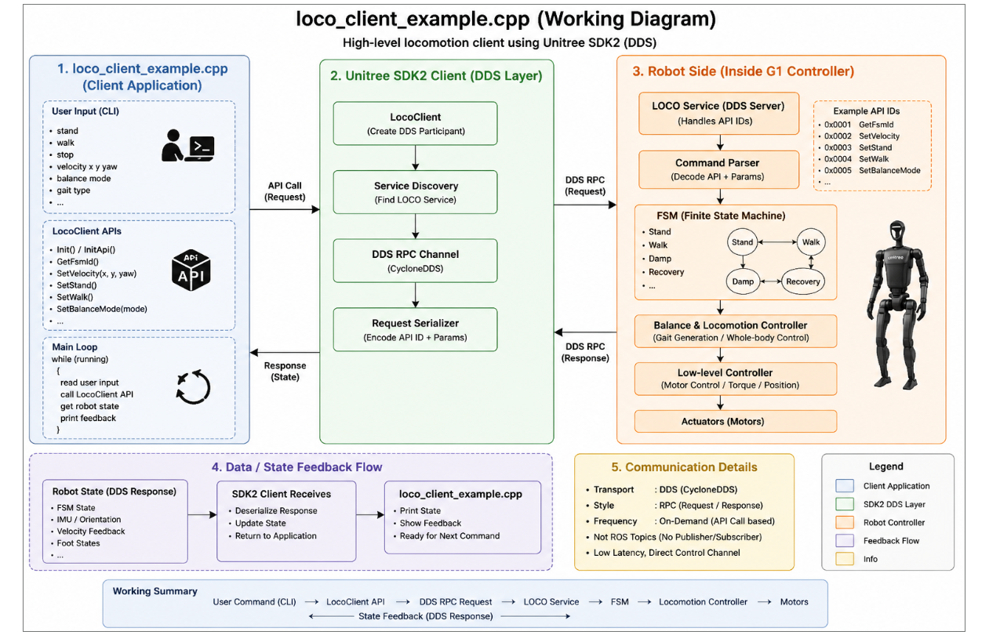

# Module Name

## Unitree G1 Locomotion Client using ROS 2  
### Understanding `loco_client_example.cpp`

---

# Introduction

This module explains the working of the **Unitree G1 locomotion client example** implemented in:

https://github.com/unitreerobotics/unitree_ros2/blob/master/example/src/src/g1/high_level/loco_client_example.cpp

The example demonstrates how to control the **locomotion and high-level movement behaviors** of the Unitree G1 humanoid robot using ROS 2 and the Unitree locomotion client interface.

Unlike low-level control, where developers directly control:

- Joint positions
- Motor torques
- PD gains

this example allows developers to command the robot using:

- Walking velocity
- Turning commands
- Movement modes
- High-level locomotion APIs

The robot internally handles:

- Balance control
- Gait generation
- Footstep planning
- Whole-body coordination
- Stability management
- Low-level actuator control

This makes locomotion programming significantly easier and safer.

---

# Key Links

## Official Repository

- [Unitree ROS 2 Repository](https://github.com/unitreerobotics/unitree_ros2?utm_source=chatgpt.com)

## Example Source File

- [loco_client_example.cpp](https://github.com/unitreerobotics/unitree_ros2/blob/master/example/src/src/g1/high_level/loco_client_example.cpp?utm_source=chatgpt.com)

## Unitree SDK2

- [Unitree SDK2 Repository](https://github.com/unitreerobotics/unitree_sdk2?utm_source=chatgpt.com)

## Unitree G1 Developer Documentation

- [Unitree G1 Developer Docs](https://support.unitree.com/home/en/G1_developer?utm_source=chatgpt.com)

## CycloneDDS

- [CycloneDDS](https://cyclonedds.io/?utm_source=chatgpt.com)

## ROS 2 Documentation

- [ROS 2 Documentation](https://docs.ros.org/en/foxy/index.html?utm_source=chatgpt.com)

---

# Purpose of this Example

The main objective of this example is to demonstrate:

1. High-level locomotion control
2. Velocity-based humanoid movement
3. DDS/ROS 2 locomotion communication
4. Gait and balance management
5. Motion mode switching
6. Real-time robot movement control

This example serves as the foundation for:

- Autonomous navigation
- Teleoperation
- Mobile robotics research
- AI locomotion systems
- Human-following systems
- Reinforcement learning

---

# What is the Locomotion Client?

The locomotion client is a high-level robot interface used to command humanoid movement.

Instead of controlling individual joints, the developer sends commands such as:

```text
Walk forward
Turn left
Move sideways
Stop walking
```

The robot internally performs:

- Gait planning
- Balance stabilization
- Footstep generation
- Whole-body coordination
- Trajectory tracking

This greatly simplifies humanoid locomotion programming.

---

# High-Level Locomotion Concept

The locomotion system follows this idea:

```text
User specifies desired movement
Robot computes how to move safely
```

The developer defines:

- Desired velocity
- Direction
- Rotation
- Motion mode

The robot computes:

- Joint trajectories
- Step timing
- Foot placement
- Balance corrections

---

# Overall System Architecture

The locomotion control pipeline follows this structure:

```text
User Application
      ↓
ROS 2 / DDS Locomotion Client
      ↓
High-Level Motion Controller
      ↓
Gait Planner
      ↓
Whole-Body Controller
      ↓
Low-Level Motor Controller
      ↓
Robot Motion Execution
```

Meanwhile, feedback continuously returns to the application.



---

# ROS 2 Node Structure

The example creates a locomotion client node.

Responsibilities include:

- ROS 2 initialization
- DDS communication setup
- Locomotion command publishing
- State monitoring
- Real-time control loop execution

The node communicates with the robot using the Unitree SDK2 communication framework.

---

# DDS-Based Communication

The example uses DDS communication internally through Unitree SDK2.

DDS provides:

- Real-time communication
- Low latency
- Reliable transport
- Distributed robot communication

ROS 2 itself is built on DDS middleware. :contentReference[oaicite:6]{index=6}

---

# CycloneDDS Middleware

The Unitree SDK2 communication system is built on:

```text
CycloneDDS
```

Responsibilities include:

- Topic discovery
- Message transport
- Serialization
- Network communication

This allows fast and reliable robot communication.

---

# High-Level Motion Commands

The locomotion client typically sends velocity-based commands.

Common command components include:

```text
vx
vy
yaw_rate
```

---

# Forward Velocity

```text
vx
```

Controls forward and backward movement.

Example:

```text
vx = 0.5 m/s
```

The robot walks forward.

---

# Lateral Velocity

```text
vy
```

Controls side movement.

Example:

```text
vy = 0.2 m/s
```

The robot strafes sideways.

---

# Yaw Rate

```text
yaw_rate
```

Controls turning rotation.

Example:

```text
yaw_rate = 0.3 rad/s
```

The robot turns while walking.

---

# Motion Modes

The locomotion client can switch between different movement modes.

Examples include:

- Standing
- Walking
- Recovery
- Motion enable
- Idle state

The robot internally manages safe transitions between these modes.

---

# High-Level Motion Controller

The robot internally processes locomotion commands.

Responsibilities include:

- Parsing movement commands
- Motion mode management
- Behavior selection
- Stability handling

This layer acts as the main behavior manager.

---

# Gait Planner

The gait planner generates walking trajectories.

Responsibilities include:

- Footstep planning
- Step timing
- Walking pattern generation
- Dynamic gait control

This subsystem determines:

- Where the feet should move
- When each step occurs
- How balance is maintained

---

# Whole-Body Controller

The whole-body controller coordinates:

- Legs
- Arms
- Torso
- Balance system

Responsibilities include:

- Inverse kinematics
- Stability control
- Contact handling
- Dynamic balancing

This is critical for stable humanoid walking.

---

# Low-Level Motor Controller

After planning is complete, the low-level controller generates actuator commands.

Responsibilities include:

- Joint trajectory tracking
- Position control
- Velocity control
- Torque control

This layer directly drives the robot actuators.

---

# Real-Time Feedback System

The robot continuously publishes feedback data.

Typical feedback includes:

- Robot posture
- IMU data
- Joint states
- Velocity estimation
- Foot contact information

This creates a real-time closed-loop locomotion system.

---

# State Estimation

The robot continuously estimates:

- Orientation
- Velocity
- Position
- Stability state
- Contact state

using sensor fusion.

Sensors include:

- IMU
- Joint encoders
- Force sensors
- Contact sensors

---

# Real-Time Control Loop

The locomotion client continuously operates in a real-time loop.

Pipeline:

```text
1. Generate motion command
2. Send locomotion request
3. Robot computes gait
4. Robot executes motion
5. Receive robot feedback
6. Repeat
```

The loop runs continuously while the robot moves.

---

# Example Movement Behaviors

Typical movements demonstrated include:

- Walking forward
- Turning
- Standing
- Velocity tracking
- Dynamic locomotion

The robot automatically maintains stability throughout movement.

---

# Why High-Level Locomotion is Important

Humanoid walking is extremely complex.

Without high-level control, developers would need to manually implement:

- Balance algorithms
- Gait generation
- Inverse kinematics
- Dynamic stability
- Footstep planning

The locomotion client abstracts all this complexity.

---

# Advantages of the Locomotion Client

## 1. Easier Development

Developers focus on behavior instead of motor control.

---

## 2. Automatic Balance

The robot internally stabilizes itself.

---

## 3. Faster Prototyping

Applications can be built quickly using velocity commands.

---

## 4. Safer Operation

Internal controllers reduce risks of instability.

---

## 5. Whole-Body Coordination

The robot automatically coordinates:

- Legs
- Arms
- Torso
- Balance

during locomotion.

---

# Typical Applications

The locomotion client is commonly used in:

- Autonomous navigation
- Teleoperation
- Mobile manipulation
- AI robotics
- Service robots
- Human-following systems
- Research robotics


The robot network and DDS configuration must be properly configured before execution.

---

# Important Safety Notes

Humanoid locomotion can be dangerous if incorrectly configured.

Improper commands may cause:

- Robot falls
- Collisions
- Instability
- Unsafe movement

Always:

- Test in open areas
- Start with low velocities
- Keep emergency stop ready
- Ensure no nearby obstacles

The official examples also warn users to maintain a safe environment during execution. :contentReference[oaicite:7]{index=7}

---

# Why This Example is Important

This example introduces several core humanoid robotics concepts:

- High-level locomotion control
- Velocity-based movement
- DDS robot communication
- Gait generation
- Whole-body coordination
- Real-time humanoid control
- Autonomous walking interfaces

These concepts are foundational for advanced humanoid robotics development.


---

# Summary

The `loco_client_example.cpp` file demonstrates how to control the locomotion and high-level movement behaviors of the Unitree G1 humanoid robot using ROS 2 and Unitree SDK2.

The example teaches:

- High-level humanoid locomotion control
- Velocity-based robot movement
- DDS-based communication
- Gait planning architecture
- Whole-body balancing
- Real-time humanoid control systems

Instead of manually controlling motors and joints, the developer simply specifies desired robot movement while the robot internally handles:

- Balance
- Walking trajectories
- Footstep planning
- Stability control
- Whole-body coordination

Understanding this example is an essential step toward advanced humanoid locomotion, autonomous navigation, and AI-driven robot mobility systems.
