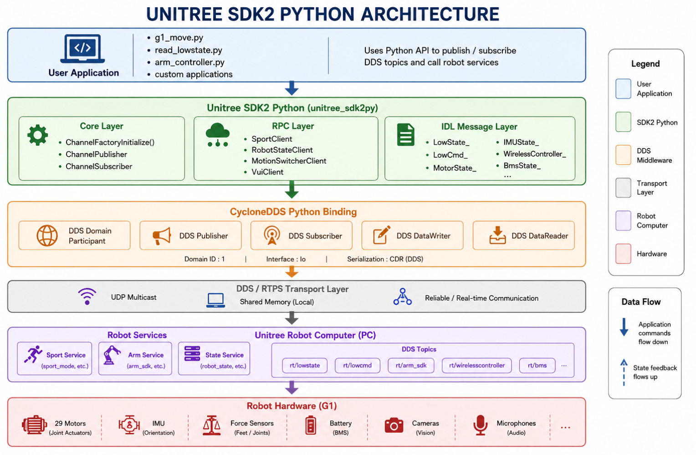

# Module 3: Unitree G1 Programming using Python and ROS 2

## 00-Introduction to Unitree SDK Python

Python has become one of the most widely used programming languages in robotics due to its simplicity, rich ecosystem, and extensive support for Artificial Intelligence (AI) and Machine Learning (ML). The Unitree G1 humanoid robot provides a complete Python SDK that enables developers to access robot sensors, actuators, and services without writing low-level C++ code.

In this module, we explore how to program the Unitree G1 using both the **Unitree SDK2 Python library** and **ROS 2 Python (rclpy)**. You will learn how to communicate with the robot, read robot states, send low-level and high-level control commands, and understand how the SDK communicates internally with the robot using DDS middleware.

By the end of this module, you will understand the architecture of the Unitree software stack and be able to develop Python applications that interact with the G1 robot.

---

# Key Links

## Unitree Robotics

- Official Website: https://www.unitree.com

## Unitree SDK2 Python

- https://github.com/unitreerobotics/unitree_sdk2_python

## Unitree SDK2

- https://github.com/unitreerobotics/unitree_sdk2

## Unitree ROS 2

- https://github.com/unitreerobotics/unitree_ros2

## ROS 2 Documentation

- https://docs.ros.org

---

# Notes

## List of Topics

- Introduction to Unitree Python SDK
- Setting Up Unitree SDK2 Python
- Reading Robot State using Python SDK
- Low-Level Joint Control using Python SDK
- High-Level Robot Control using Python SDK
- Introduction to ROS 2 Python Programming
- Unitree ROS 2 Driver
- Unitree SDK2 Python Architecture
- Practice and Exercises
- Additional Resources

---

# Introduction to Unitree Python SDK

The Unitree Python SDK provides a Python interface for communicating with the Unitree G1 robot. Instead of writing applications in C++, developers can use Python to access robot services, publish commands, subscribe to robot states, and build AI applications.

The SDK internally communicates with the robot using **DDS (Data Distribution Service)**, enabling reliable real-time communication.

Python is particularly useful for:

- AI applications
- Machine Learning
- Reinforcement Learning
- Rapid prototyping
- Robotics research

---

# Unitree G1 Software Architecture

The Unitree G1 software stack consists of multiple layers that allow applications running on a development computer to communicate with the robot hardware.

The main components include:

- Unitree Robot Computer
- DDS Middleware
- Unitree SDK
- ROS 2 SDK
- Development Computer
- User Applications

The architecture allows developers to choose between:

- Direct SDK programming
- ROS 2 programming

depending on the application requirements.

---

# Programming Approaches

The Unitree G1 supports two primary software development approaches.

## Direct SDK Approach

In this approach, the application communicates directly with the Unitree SDK2 Python library.


```
Python Application
        │
        ▼
Unitree SDK2 Python
        │
        ▼
      DDS
        │
        ▼
     Robot
```

### Advantages

- Lowest communication overhead
- Maximum flexibility
- Suitable for robotics research
- Ideal for standalone applications

---

## ROS 2 Approach

In this approach, applications communicate through ROS 2.

```
ROS 2 Python Application
          │
          ▼
      ROS 2 Driver
          │
          ▼
      ROS 2 RMW
          │
          ▼
          DDS
          │
          ▼
        Robot
```

### Advantages

- Native ROS 2 ecosystem support
- Easy integration with Navigation2
- Compatible with MoveIt
- Supports multi-robot systems
- Modular software architecture

---

# DDS Communication

Both SDK2 and ROS 2 communicate with the robot using **DDS (Data Distribution Service)**.

DDS provides:

- Publish / Subscribe communication
- Request / Response communication
- Reliable messaging
- Real-time data exchange
- Distributed communication

DDS is responsible for exchanging data between the development computer and the robot.

---

# Unitree SDK2 Python Architecture

The Unitree SDK2 Python library is organized into multiple layers that simplify communication with the G1 robot while hiding the complexity of DDS programming.

---

## Overall Architecture


unitree_python_arch.png

```
User Application
        │
        ▼
Unitree SDK2 Python
(Core, RPC, IDL Messages)
        │
        ▼
CycloneDDS Python Binding
        │
        ▼
DDS / RTPS Transport
        │
        ▼
Unitree Robot Computer
        │
        ▼
Robot Hardware
```

---

## User Application Layer

This is where developers write Python programs such as:

- g1_move.py
- read_lowstate.py
- arm_controller.py
- Custom robotics applications

The application uses Python APIs to:

- Publish DDS messages
- Subscribe to robot states
- Call robot services

---

## SDK2 Python Layer (`unitree_sdk2py`)

This layer provides high-level Python APIs and consists of three major components.

### Core Layer

Responsible for communication infrastructure.

Functions include:

- ChannelFactoryInitialize()
- ChannelPublisher
- ChannelSubscriber

---

### RPC Layer

Provides service clients for controlling robot functions.

Examples include:

- SportStateClient
- RobotStateClient
- MotionSwitchClient
- VuiClient

---

### IDL Message Layer

Contains the DDS message definitions used by the SDK.

Common message types include:

- LowState
- LowCmd
- MotorState
- IMUState
- WirelessController
- BmsState

These messages define the data exchanged between the application and the robot.

---

## CycloneDDS Python Binding

The SDK communicates with DDS through CycloneDDS Python bindings.

Responsibilities include:

- Domain Participant
- Publisher
- Subscriber
- DataWriter
- DataReader
- CDR Serialization

This layer converts Python objects into DDS messages and vice versa.

---

## DDS / RTPS Transport Layer

Provides the communication infrastructure using:

- UDP Multicast
- Shared Memory
- RTPS Protocol

This layer ensures reliable real-time communication between the development computer and the robot.

---

## Unitree Robot Computer

The onboard robot computer hosts multiple DDS topics and services.

Examples include:

- /rt/lowstate
- /rt/lowcmd
- /rt/arm_sdk
- /rt/wirelesscontroller
- /rt/bms

These interfaces expose robot state information and receive control commands.

---

## Robot Hardware

At the lowest level are the physical hardware components:

- Joint Motors
- IMU
- Force Sensors
- Battery Management System (BMS)
- Cameras
- Microphones

Commands generated by the application eventually reach these hardware components through the software stack.

---

# Reading Robot State

Using the SDK, developers can monitor robot information such as:

- Joint Positions
- Joint Velocities
- Motor Torque
- IMU Data
- Battery Status
- Robot Mode
- Controller State

This information is received through DDS subscriptions.

---

# Low-Level Joint Control

Low-level control allows developers to directly command each joint by specifying:

- Position
- Velocity
- Torque
- Stiffness (Kp)
- Damping (Kd)

This mode is primarily used for:

- Reinforcement Learning
- Whole-body Control
- Custom Locomotion
- Robotics Research

---

# High-Level Robot Control

High-level APIs simplify robot operation by providing predefined behaviors such as:

- Standing
- Walking
- Sitting
- Motion transitions
- Sport Mode functions

These APIs internally manage joint coordination and robot stability.

---

# ROS 2 Python Programming

The Unitree ROS 2 package integrates the robot into the ROS 2 ecosystem.

Using ROS 2 Python (`rclpy`), developers can:

- Publish robot commands
- Subscribe to robot state topics
- Call ROS services
- Build complete ROS 2 applications
- Integrate with Navigation2, MoveIt, and perception frameworks

---

# SDK2 Python vs ROS 2

## Use SDK2 Python when:

- Building standalone robot applications
- Developing custom controllers
- Performing robotics research
- Minimizing communication overhead

---

## Use ROS 2 when:

- Building modular robotics systems
- Integrating navigation and perception
- Working with multiple robots
- Leveraging existing ROS 2 packages

---

# Important Takeaway

> **The Unitree SDK2 Python library provides direct access to the robot through DDS, while the ROS 2 interface builds on top of the SDK to enable seamless integration with the broader ROS ecosystem.**

Understanding both approaches allows developers to choose the most appropriate programming model for their robotics application.

---

# Summary

In this lesson, we explored Python programming for the Unitree G1 humanoid robot.

We learned:

- The architecture of the Unitree software stack
- How the Python SDK communicates using DDS
- The difference between SDK2 and ROS 2 programming
- The internal architecture of the Unitree SDK2 Python library
- When to use direct SDK programming versus ROS 2 integration

This knowledge provides a solid foundation for developing intelligent robotics applications using Python, ROS 2, and the Unitree G1 platform.