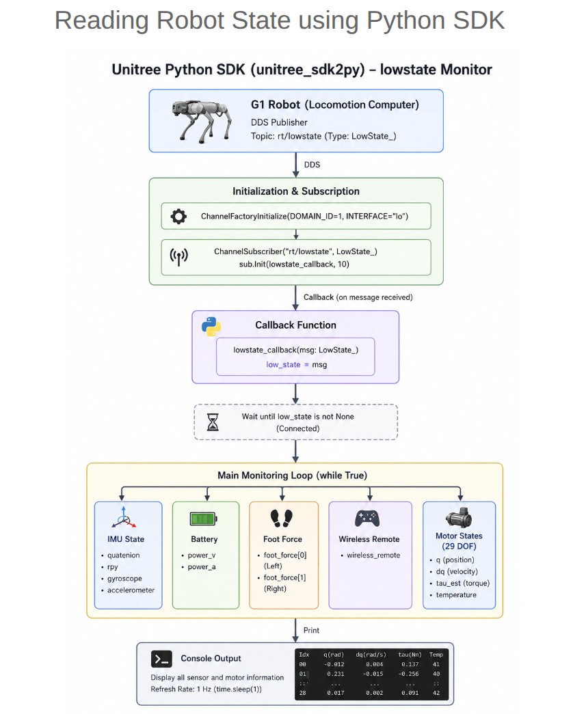

# Module 3: Unitree G1 Programming using Python and ROS 2


# 02-Reading Robot State using Python SDK

## Introduction

Reading the robot state is one of the first tasks when developing
applications for the Unitree G1 humanoid robot. Before sending motion
commands, a developer should verify that communication with the robot is
working correctly and that valid sensor data is being received.

The `read_robot_state.py` example demonstrates how to subscribe to the
**LowState** DDS topic using the Unitree SDK2 Python library. It
continuously receives the latest robot state and displays useful
information such as IMU data, battery information, foot force
measurements, wireless controller status, and motor states.

------------------------------------------------------------------------

# Learning Objectives

After completing this lesson, you will be able to:

-   Initialize DDS communication using the Unitree SDK2 Python library.
-   Subscribe to the `rt/lowstate` topic.
-   Receive robot state data using a callback function.
-   Read IMU, battery, foot force, and motor state information.
-   Run the example on both simulation and a real robot.

------------------------------------------------------------------------

# Robot State Data Flow




    Unitree G1 Robot
            │
    Publishes LowState
            │
            ▼
    DDS Middleware
            │
            ▼
    ChannelSubscriber
            │
            ▼
    Callback Function
            │
            ▼
    Latest LowState Message
            │
            ▼
    Display Sensor Values

------------------------------------------------------------------------

# Understanding the Program

The example uses the following components:

-   `ChannelFactoryInitialize()` -- Initializes DDS communication.
-   `ChannelSubscriber()` -- Creates a subscriber for the robot state
    topic.
-   `LowState_` -- Message type containing robot state information.
-   Callback function -- Stores the most recently received state.

------------------------------------------------------------------------

# Initializing DDS

Before subscribing to any topic, the DDS communication layer must be
initialized.

The example accepts the network interface as a command-line argument.

Simulation:

``` bash
python3 read_robot_state.py lo
```

Real robot:

``` bash
python3 read_robot_state.py eth0
```

If no interface is supplied, the example defaults to the loopback
interface (`lo`).

------------------------------------------------------------------------

# Creating the Subscriber

The subscriber listens to the `rt/lowstate` topic.

``` python
sub = ChannelSubscriber("rt/lowstate", LowState_)
sub.Init(lowstate_callback, 10)
```

Whenever a new DDS message arrives, the callback function is invoked
automatically.

------------------------------------------------------------------------

# Callback Function

The callback stores the latest robot state.

``` python
def lowstate_callback(msg):
    global low_state
    low_state = msg
```

The main program later reads values from this shared variable.

------------------------------------------------------------------------

# Waiting for the First Message

Before accessing robot data, the program waits until the first state
message is received.

``` python
while low_state is None:
    time.sleep(0.1)
```

Once connected, the program enters the monitoring loop.

------------------------------------------------------------------------

# Reading IMU Data

The IMU provides the robot's orientation and motion.

Available fields include:

-   Quaternion
-   Roll, Pitch, Yaw (RPY)
-   Gyroscope
-   Accelerometer

Example:

``` python
imu = low_state.imu_state
print(imu.quaternion)
print(imu.rpy)
```

------------------------------------------------------------------------

# Reading Battery Information

Battery information includes:

-   Battery Voltage (`power_v`)
-   Battery Current (`power_a`)

These values may not be available in every simulator configuration.

------------------------------------------------------------------------

# Reading Foot Force Sensors

The G1 reports force measurements from the feet.

``` python
low_state.foot_force[0]
low_state.foot_force[1]
```

Typical uses include:

-   Contact detection
-   Walking control
-   Balance monitoring

------------------------------------------------------------------------

# Reading Wireless Controller State

The program can also display the state of the wireless remote
controller.

This is useful for verifying controller connectivity while developing
applications.

------------------------------------------------------------------------

# Reading Motor States

Each motor provides several important parameters:

  Field         Description
  ------------- -----------------------------
  q             Joint position (radians)
  dq            Joint velocity (rad/s)
  tau_est       Estimated joint torque (Nm)
  temperature   Motor temperature

The example iterates through all motors and prints these values once
every second.

------------------------------------------------------------------------

# Running the Example

Simulation:

``` bash
python3 read_robot_state.py lo
```

Real Robot:

``` bash
python3 read_robot_state.py eth0
```

Replace `eth0` with the appropriate network interface if necessary.

------------------------------------------------------------------------

# Typical Console Output

    IMU
    Quaternion : (...)
    RPY        : (...)
    Gyroscope  : (...)

    Battery
    Voltage : 53.8
    Current : 2.1

    Motors
    Idx    q(rad)   dq(rad/s)   tau(Nm)
    00     0.000    0.001       0.032
    ...

------------------------------------------------------------------------

# Common Issues

## Waiting Forever

Possible causes:

-   DDS not initialized
-   Wrong network interface
-   Robot not publishing `rt/lowstate`

## Import Errors

Ensure the SDK has been installed:

``` bash
pip3 install -e .
```

## No Robot Data

Verify:

-   Robot is powered on
-   DDS Domain ID is correct
-   Network interface is correct

------------------------------------------------------------------------

# Best Practices

-   Always verify robot state before sending motion commands.
-   Confirm IMU values change when moving the robot.
-   Check battery voltage before testing.
-   Monitor joint temperatures during long experiments.
-   Use this example to validate DDS communication before developing
    controllers.

------------------------------------------------------------------------

# Summary

In this lesson, we learned how to monitor the Unitree G1 robot state
using the Unitree SDK2 Python library.

We covered:

-   DDS initialization
-   Subscribing to the `rt/lowstate` topic
-   Callback-based message handling
-   Reading IMU, battery, foot force, and motor data
-   Running the example in simulation and on a real robot
-   Troubleshooting common communication issues

This example provides the foundation for developing monitoring,
diagnostics, and control applications for the Unitree G1.