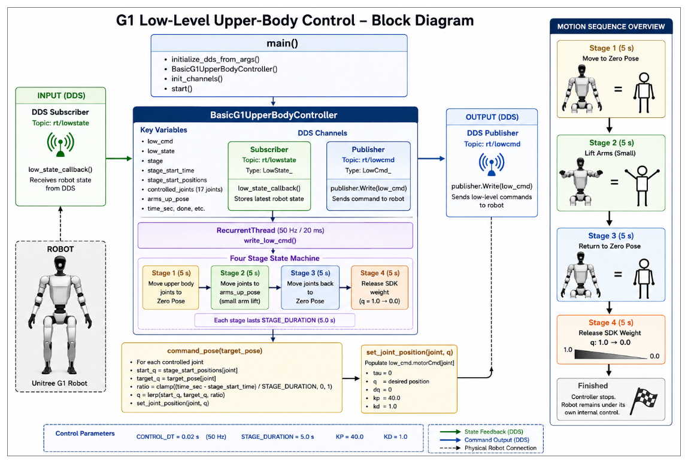

# Low-Level Joint Control using Python SDK – Example 1

## Introduction

In the previous lesson, we learned how to receive robot state information from the Unitree G1 using the Python SDK. Reading the robot state allows us to monitor sensor data such as IMU measurements, joint positions, motor velocities, battery information, and foot force sensors.

The next logical step is to **control the robot**.

This lesson introduces **low-level joint control**, where the application directly commands individual motors by publishing **LowCmd** messages through the Unitree SDK. Unlike high-level APIs that provide commands such as *Walk*, *Stand*, or *Sit*, low-level control gives the developer complete authority over every joint of the robot.

In this example, we build a simple upper-body controller that demonstrates how to:

- Subscribe to the robot's current state
- Generate smooth joint trajectories
- Publish motor commands
- Execute a multi-stage motion sequence
- Release control safely after the demonstration

By the end of this lesson, you will understand how a real-time low-level controller is implemented using the Unitree Python SDK.

---

# Learning Objectives

After completing this lesson, you should be able to:

- Explain the purpose of low-level control.
- Initialize DDS communication.
- Publish LowCmd messages.
- Subscribe to LowState messages.
- Understand the role of KP and KD gains.
- Generate smooth joint trajectories using interpolation.
- Build a simple state-machine-based robot controller.
- Release robot control safely after execution.

---

# What is Low-Level Joint Control?

Low-level control means directly commanding individual motors of the robot.

Instead of telling the robot:

> "Raise your arms"

the controller sends commands such as:

```
Left Shoulder Roll = 0.5 rad
Left Elbow = 0.5 rad
Right Shoulder Roll = -0.5 rad
```

Every joint receives its own command packet.

Each packet contains:

- Desired Position (`q`)
- Desired Velocity (`dq`)
- Feed-forward Torque (`tau`)
- Proportional Gain (`KP`)
- Derivative Gain (`KD`)

These commands are transmitted repeatedly to the robot at a fixed frequency.

---

# Why Use Low-Level Control?

Low-level control provides complete access to the robot's actuators.

This approach is commonly used for:

- Robotics research
- Reinforcement learning
- Whole-body control
- Motion generation
- Custom locomotion
- Controller development

Because the developer controls every joint directly, it offers maximum flexibility.

However, it also requires careful implementation because incorrect commands can produce unstable or unsafe robot motion.

---

# Overall Controller Architecture




The controller follows the architecture shown below.

```

                Robot
                   │
          DDS publishes LowState
                   │
                   ▼
          ChannelSubscriber
                   │
                   ▼
        low_state_callback()
                   │
                   ▼
      BasicG1UpperBodyController
                   │
         State Machine Logic
                   │
                   ▼
        command_pose()
                   │
                   ▼
     set_joint_position()
                   │
                   ▼
          Generate LowCmd
                   │
             Compute CRC
                   │
                   ▼
          ChannelPublisher
                   │
                   ▼
                Robot

```

The controller continuously receives the latest robot state, computes the desired joint positions, and publishes new motor commands.

---

# Understanding the Motion Sequence

Instead of commanding the robot to jump immediately into the demonstration pose, the motion is divided into four stages.

This approach ensures smooth and safe movement.

## Stage 1 – Move to Zero Pose

Duration: **5 seconds**

The controller first moves every controlled upper-body joint toward its neutral position.

Why?

The robot may start from any posture.

Moving to a known reference position guarantees:

- Smooth interpolation
- Predictable motion
- Safe controller initialization

---

## Stage 2 – Lift the Arms

Duration: **5 seconds**

After reaching the neutral pose, the controller slowly raises both arms.

Only the following joints move:

- Left Shoulder Roll
- Right Shoulder Roll
- Left Elbow
- Right Elbow

The remaining joints remain close to zero.

---

## Stage 3 – Return to Zero Pose

Duration: **5 seconds**

The controller reverses the interpolation process and smoothly returns every joint to the neutral position.

Returning to zero avoids sudden discontinuities before releasing control.

---

## Stage 4 – Release SDK Weight

Duration: **5 seconds**

During motion, the SDK maintains full authority over the robot by setting the SDK control weight to:

```

q = 1.0

```

In the final stage, this value gradually decreases to:

```

q = 0.0

```

This safely returns control to the robot's internal controller.

---

# Controller Variables

The controller maintains several important variables.

| Variable | Purpose |
|-----------|----------|
| `low_cmd` | Stores the command packet sent to the robot |
| `low_state` | Latest robot feedback received from DDS |
| `stage` | Current motion stage |
| `stage_start_time` | Time at which the current stage began |
| `stage_start_positions` | Joint positions recorded at stage entry |
| `controlled_joints` | List of joints controlled by the example |
| `arms_up_pose` | Target joint positions for Stage 2 |

Rather than allocating a new command message every cycle, the same `low_cmd` object is reused. This reduces memory allocation and improves deterministic execution.

---