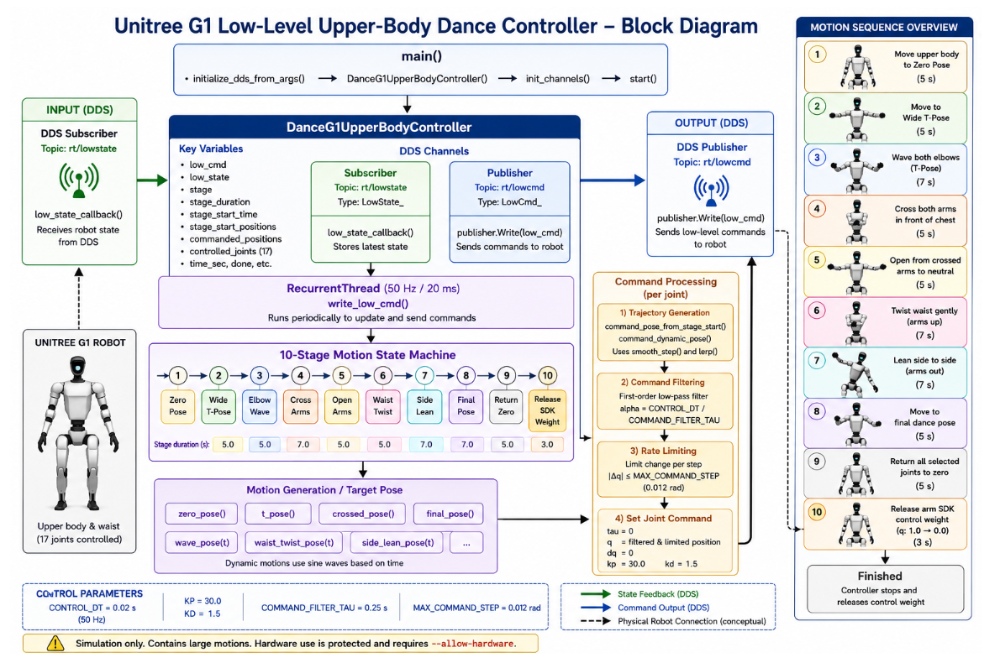

# Module 3: Unitree G1 Programming using Python and ROS 2

# Low-Level Joint Control using Python SDK – Example 2

## Introduction

This lesson demonstrates an advanced low-level controller for the Unitree G1 humanoid robot using the Unitree SDK2 Python library. Unlike the previous example, which moved the robot through a few simple poses, this controller performs a complete upper-body dance sequence using staged motion planning.

## Learning Objectives

- Explain the architecture of a low-level controller.
- Initialize DDS communication.
- Create DDS publishers and subscribers.
- Generate static and dynamic poses.
- Apply SmoothStep interpolation.
- Understand command filtering and rate limiting.

---

# Running the Example in Simulation

## Step 1 – Start the Unitree MuJoCo Simulation

Launch the simulator and ensure the robot is standing.

## Step 2 – Open a New Terminal

```bash
cd ~/ROS2/examples_unitree_python_sdk
```

## Step 3 – Run the Example

```bash
python3 low_level_example_2.py
```

or

```bash
python3 low_level_example_2.py lo
```

## Running on Hardware

```bash
python3 low_level_example_2.py eth0 --allow-hardware
```

Always validate the controller in simulation first.

---

# Controller Architecture



```
Robot
  │
DDS LowState
  │
ChannelSubscriber
  │
DanceG1UpperBodyController
  │
Motion State Machine
  │
Pose Generator
  │
Motion Filter
  │
LowCmd
  │
CRC
  │
ChannelPublisher
  │
Robot
```

---

# Motion Sequence

1. Move to Zero Pose
2. Move to Wide T-Pose
3. Elbow Wave
4. Cross Arms
5. Return to Neutral
6. Waist Twist
7. Side Lean
8. Final Dance Pose
9. Return to Zero
10. Release SDK Control Weight

---

# Pose Generation

The controller generates multiple reusable poses:

- zero_pose()
- t_pose()
- crossed_pose()
- wave_pose()
- waist_twist_pose()
- side_lean_pose()
- final_pose()

These are blended using interpolation to create smooth robot motion.

---

# Motion Filtering

The controller filters outgoing joint commands before publishing.

Benefits:

- Smooth movement
- Reduced oscillation
- Improved safety

---

# Real-Time Control Loop

A RecurrentThread executes every 20 ms (50 Hz):

1. Read stage
2. Compute pose
3. Filter commands
4. Generate LowCmd
5. Compute CRC
6. Publish

---

# Safety

- Simulation-first design
- Hardware protection flag
- Rate limiting
- Command filtering
- Controlled SDK release

---

# Summary

This example demonstrates a complete staged upper-body dance controller using the Unitree SDK2 Python library. It introduces motion state machines, pose generation, interpolation, filtering, CRC generation, and safe low-level control techniques.