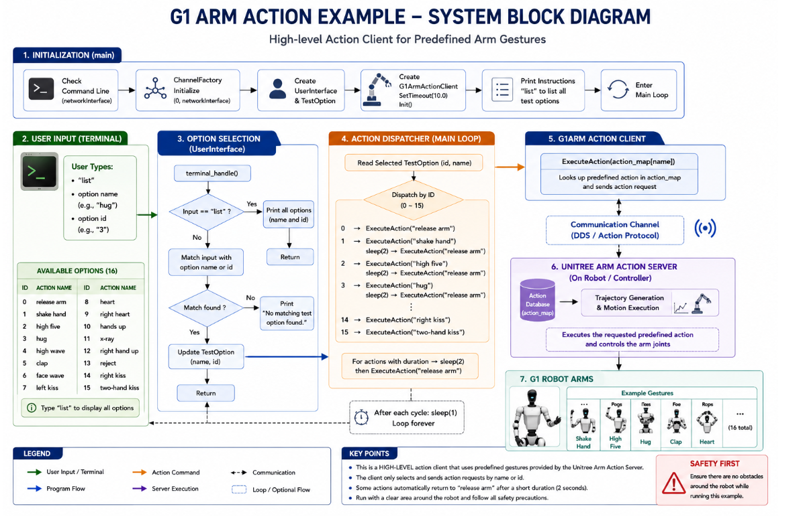

# Module 3: Unitree G1 Programming using Python and ROS 2

# High-Level Arm Control using Python SDK – Example 1

## Introduction

In the previous lessons, we explored how to control the Unitree G1 robot using low-level motor commands. While low-level control provides complete access to every joint, many robotics applications only require predefined arm gestures such as handshakes, waving, hugging, or clapping.

Developing these gestures manually using low-level joint trajectories requires significant effort. Instead, the Unitree SDK provides a **High-Level Arm Action API** that allows developers to execute complex arm motions using a single API call.

In this example, the robot is controlled through a simple terminal interface. The user enters either the name or numerical ID of an arm action, and the program sends the corresponding command to the Unitree G1 using the **G1ArmActionClient**.

This example serves as an introduction to the High-Level Arm SDK before integrating the same functionality into ROS 2 applications.

By the end of this lesson, you will understand how to initialize the Unitree High-Level Arm SDK, execute predefined gestures, and safely release arm control.

---

# Learning Objectives

After completing this lesson, you should be able to:

- Explain the purpose of the High-Level Arm Action API.
- Initialize DDS communication.
- Create and initialize the G1ArmActionClient.
- Execute predefined arm gestures.
- Understand the action mapping mechanism.
- Select actions using either names or numerical IDs.
- Automatically release arm control after selected gestures.

---

# Running the Example in Simulation

Before running the example, ensure that the Unitree G1 simulation environment is already running.

## Step 1 – Start the Unitree MuJoCo Simulation

Launch the Unitree G1 simulator and verify that the robot is standing correctly.

---

## Step 2 – Open a New Terminal

Navigate to the example directory.

```bash
cd ~/ROS2/examples_unitree_python_sdk
```

---

## Step 3 – Run the Example

Execute the program.

```bash
python3 g1_arm_action_example.py lo
```

The argument **lo** specifies the loopback network interface, which is used when communicating with the local simulator.

The terminal should display:

```text
WARNING: Please ensure there are no obstacles around the robot while running this example.

Press Enter to continue...
```

Press **Enter** to continue.

---

## Step 4 – Display Available Actions

Type:

```text
list
```

The program displays all supported arm actions.

Example:

```text
release arm
shake hand
high five
hug
...
```

---

## Step 5 – Execute an Arm Action

Enter either the action name:

```text
shake hand
```

or the action ID:

```text
1
```

The robot immediately executes the corresponding gesture.

---

# Running on Real Hardware

To communicate with a physical Unitree G1 robot, specify the Ethernet interface connected to the robot.

Example:

```bash
python3 g1_arm_action_example.py eth0
```

Replace **eth0** with the correct network interface on your computer.

Before executing any arm action:

- Ensure there is sufficient space around the robot.
- Keep people outside the robot's workspace.
- Test new programs in simulation first.

---

# Overall System Architecture



```
Terminal Input

      │

      ▼

User Interface

      │

      ▼

Action Selection

      │

      ▼

Action Mapping

      │

      ▼

G1ArmActionClient

      │

      ▼

Unitree SDK

      │

      ▼

DDS Communication

      │

      ▼

Unitree G1 Robot
```

The controller continuously waits for user input. Once a valid action is selected, it sends the corresponding command to the Unitree SDK.

---

# Supported Arm Actions

The example supports the following predefined gestures.

| ID | Action | Description |
|----|---------|-------------|
| 0 | Release Arm | Release SDK arm control |
| 1 | Shake Hand | Perform a handshake |
| 2 | High Five | Raise the hand for a high five |
| 3 | Hug | Perform a hugging gesture |
| 4 | High Wave | Wave above the head |
| 5 | Clap | Clap both hands |
| 6 | Face Wave | Wave near the face |
| 7 | Left Kiss | Left-side kiss gesture |
| 8 | Heart | Heart gesture |
| 9 | Right Heart | Right-hand heart gesture |
| 10 | Hands Up | Raise both hands |
| 11 | X-Ray | Cross-arm pose |
| 12 | Right Hand Up | Raise the right hand |
| 13 | Reject | Reject/stop gesture |
| 14 | Right Kiss | Right-side kiss gesture |
| 15 | Two-Hand Kiss | Two-handed kiss gesture |

---

# Understanding the Program

The example consists of three primary components.

## User Interface

The terminal interface waits for user input.

The user may enter:

- An action name
- An action ID
- The keyword **list**

This provides a simple way to test arm actions without requiring ROS 2.

---

## Action Mapping

After receiving user input, the program searches the predefined action list.

If a matching action is found, the corresponding Unitree SDK action is selected.

For example:

```
shake hand

↓

Action ID = 1

↓

ExecuteAction()
```

---

## G1ArmActionClient

The **G1ArmActionClient** provides the interface between the application and the Unitree robot.

It is responsible for:

- Initializing the SDK
- Sending arm action requests
- Communicating through DDS
- Triggering predefined robot motions

The application does not generate joint trajectories.

Instead, the robot executes internally stored motion sequences.

---

# DDS Communication

Before sending any commands, the program initializes DDS communication.

```
ChannelFactoryInitialize()

↓

DDS Middleware

↓

Unitree Robot
```

This allows the application to communicate directly with the robot using the Unitree communication framework.

---

# Automatic Arm Release

Some arm gestures temporarily take control of the robot's upper body.

After these gestures finish, the program automatically executes the **Release Arm** action.

Benefits include:

- Returns the arms to a relaxed state.
- Matches the original Unitree SDK behavior.
- Prevents unnecessary arm stiffness.
- Improves safety before executing another action.

Not every gesture requires an automatic release.

---

# Program Workflow

The controller follows the sequence below.

```
Start Program

↓

Initialize DDS

↓

Initialize G1ArmActionClient

↓

Wait for User Input

↓

Parse Action

↓

Validate Action

↓

Execute SDK Action

↓

(Optional)

Release Arm

↓

Wait for Next Command
```

This loop continues until the program is terminated.

---

# Safety Considerations

Before executing arm actions:

- Ensure sufficient clearance around the robot.
- Never stand within the arm workspace.
- Test new applications in simulation.
- Verify communication before sending commands.

Some arm gestures involve rapid movement and may continue briefly after the command has been issued.

---

# Best Practices

- Always initialize DDS before creating the client.
- Verify the robot is standing before executing gestures.
- Use predefined actions whenever possible.
- Release arm control after interactive demonstrations.
- Test all applications in simulation before using physical hardware.

---

# Summary

In this lesson, we learned how to control the Unitree G1 upper body using the High-Level Arm Action API provided by the Unitree Python SDK.

We explored:

- High-Level Arm SDK
- DDS initialization
- G1ArmActionClient
- Terminal-based command interface
- Action mapping
- Automatic arm release
- Program workflow
- Safe execution of predefined arm gestures

This example provides the foundation for the next lesson, where the same functionality is integrated into a ROS 2 node, allowing arm actions to be triggered through ROS topics instead of terminal input.