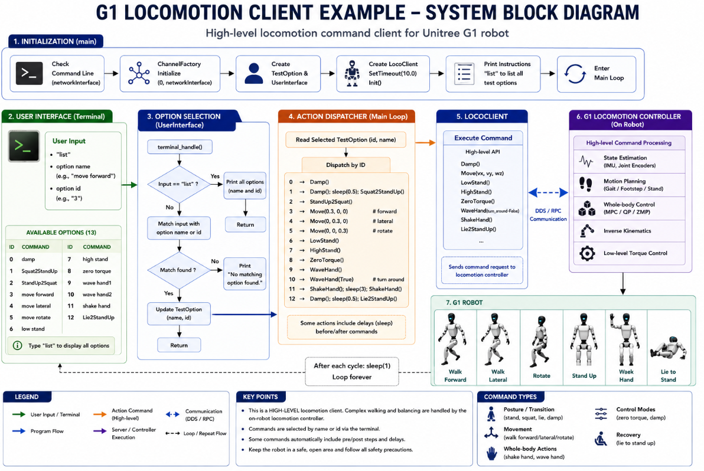

# Module 3: Unitree G1 Programming using Python and ROS 2

# High-Level Locomotion Control using Python SDK – Example 2

## Introduction

In the previous lessons, we learned how to control the Unitree G1 upper body using the High-Level Arm Action SDK. While arm gestures are useful for human-robot interaction, many robotics applications require controlling the robot's entire body, including standing, walking, rotating, and changing posture.

Developing these behaviors using low-level joint commands is extremely complex because the developer must generate stable walking trajectories, maintain robot balance, and coordinate every joint in real time.

To simplify this process, the Unitree SDK provides a **High-Level Locomotion API** through the **LocoClient** class. Instead of commanding individual joints, developers can request predefined locomotion behaviors such as standing, walking, rotating, or waving.

In this example, the robot is controlled through a terminal interface. The user enters either the name or numerical ID of a locomotion action, and the program executes the corresponding high-level behavior.

This example introduces the Unitree High-Level Locomotion SDK before integrating the same functionality into ROS 2 applications.

By the end of this lesson, you will understand how to initialize the High-Level Locomotion SDK, execute predefined locomotion behaviors, and safely control the Unitree G1 robot.

---

# Learning Objectives

After completing this lesson, you should be able to:

- Explain the purpose of the High-Level Locomotion API.
- Initialize DDS communication.
- Create and initialize the LocoClient.
- Execute predefined locomotion behaviors.
- Understand the locomotion action mapping mechanism.
- Select actions using either names or numerical IDs.
- Control robot movement using predefined SDK functions.

---

# Running the Example in Simulation

Before running the example, ensure that the Unitree G1 simulation environment is already running.

## Step 1 – Start the Unitree MuJoCo Simulation

Launch the Unitree G1 simulator and verify that the robot is standing correctly.

---

## Step 2 – Open a New Terminal

Navigate to the example directory.

```bash
cd ~/ROS2/examples_unitree_python_sdk
```

---

## Step 3 – Run the Example

Execute the program.

```bash
python3 g1_loco_client_example.py lo
```

The argument **lo** specifies the loopback network interface, which is used when communicating with the local simulator.

The terminal should display:

```text
WARNING: Please ensure there are no obstacles around the robot while running this example.

Press Enter to continue...
```

Press **Enter** to continue.

---

## Step 4 – Display Available Actions

Type:

```text
list
```

The program displays all supported locomotion commands.

Example:

```text
damp
Squat2StandUp
StandUp2Squat
move forward
move lateral
move rotate
...
```

---

## Step 5 – Execute a Locomotion Action

Enter either the action name:

```text
move forward
```

or the action ID:

```text
3
```

The robot immediately begins executing the requested locomotion behavior.

---

# Running on Real Hardware

To communicate with a physical Unitree G1 robot, specify the Ethernet interface connected to the robot.

Example:

```bash
python3 g1_loco_client_example.py eth0
```

Replace **eth0** with the correct network interface on your computer.

Before executing any locomotion action:

- Ensure there is sufficient free space around the robot.
- Verify the floor is flat and free of obstacles.
- Test new programs in simulation first.

---

# Overall System Architecture



```
Terminal Input

      │

      ▼

User Interface

      │

      ▼

Action Selection

      │

      ▼

Action Mapping

      │

      ▼

LocoClient

      │

      ▼

Unitree SDK

      │

      ▼

DDS Communication

      │

      ▼

Unitree G1 Robot
```

The controller continuously waits for user input. Whenever a valid command is entered, it executes the corresponding locomotion behavior using the Unitree SDK.

---

# Supported Locomotion Actions

The example supports the following predefined locomotion behaviors.

| ID | Action | Description |
|----|------------------|-------------------------------------------|
| 0 | Damp | Enable damping mode |
| 1 | Squat2StandUp | Stand up from a squatting position |
| 2 | StandUp2Squat | Move from standing to squatting |
| 3 | Move Forward | Walk forward |
| 4 | Move Lateral | Walk sideways |
| 5 | Move Rotate | Rotate in place |
| 6 | Low Stand | Lower standing posture |
| 7 | High Stand | Normal standing posture |
| 8 | Zero Torque | Disable motor torque |
| 9 | Wave Hand 1 | Wave while standing |
| 10 | Wave Hand 2 | Wave while turning |
| 11 | Shake Hand | Perform a handshake |
| 12 | Lie2StandUp | Recover from a lying position |

---

# Understanding the Program

The example consists of three primary components.

## User Interface

The terminal interface waits for user input.

The user may enter:

- A locomotion action name
- A locomotion action ID
- The keyword **list**

This provides a convenient way to test locomotion behaviors without requiring ROS 2.

---

## Action Mapping

After receiving user input, the program searches the predefined locomotion action list.

If a matching action is found, the corresponding SDK function is executed.

For example:

```
move forward

↓

Action ID = 3

↓

LocoClient.Move(0.3, 0, 0)
```

---

## LocoClient

The **LocoClient** provides the interface between the application and the Unitree locomotion controller.

It is responsible for:

- Initializing the SDK
- Sending locomotion requests
- Communicating through DDS
- Executing predefined walking and posture behaviors

Unlike low-level control, the application does not generate walking trajectories.

Instead, the internal Unitree locomotion controller generates all required joint motions automatically.

---

# DDS Communication

Before sending locomotion commands, the program initializes DDS communication.

```
ChannelFactoryInitialize()

↓

DDS Middleware

↓

Unitree Robot
```

This enables communication between the application and the robot using the Unitree SDK.

---

# Motion Commands

The example demonstrates several locomotion commands.

## Move Forward

```python
sport_client.Move(0.3, 0, 0)
```

The robot walks forward with a linear velocity of **0.3 m/s**.

---

## Move Lateral

```python
sport_client.Move(0, 0.3, 0)
```

The robot walks sideways while maintaining its heading.

---

## Rotate

```python
sport_client.Move(0, 0, 0.3)
```

The robot rotates about its vertical axis.

---

## Stand Commands

The SDK provides posture control functions.

- HighStand()
- LowStand()
- Squat2StandUp()
- StandUp2Squat()

These commands automatically generate stable body motions.

---

# Program Workflow

The controller follows the sequence below.

```
Start Program

↓

Initialize DDS

↓

Initialize LocoClient

↓

Wait for User Input

↓

Parse Action

↓

Validate Action

↓

Execute SDK Function

↓

Wait for Next Command
```

This process repeats until the program is terminated.

---

# Safety Considerations

Before executing locomotion commands:

- Ensure sufficient clearance around the robot.
- Keep people away from the walking area.
- Test all locomotion behaviors in simulation first.
- Verify communication before sending commands.

The **Lie2StandUp()** function should only be executed when:

- The robot is lying face up.
- The ground is flat.
- The surface provides sufficient friction.

---

# Best Practices

- Always initialize DDS before creating the LocoClient.
- Verify the robot is stable before walking.
- Test locomotion in simulation before using hardware.
- Stop the robot before switching locomotion modes.
- Ensure sufficient operating space around the robot.

---

# Summary

In this lesson, we learned how to control the Unitree G1 using the High-Level Locomotion API provided by the Unitree Python SDK.

We explored:

- High-Level Locomotion SDK
- DDS initialization
- LocoClient
- Terminal-based command interface
- Locomotion action mapping
- Walking commands
- Posture control
- Safe execution of locomotion behaviors

This example provides the foundation for the next lesson, where the same locomotion functions are integrated into a ROS 2 node, allowing robot movement to be controlled through ROS topics instead of terminal input.