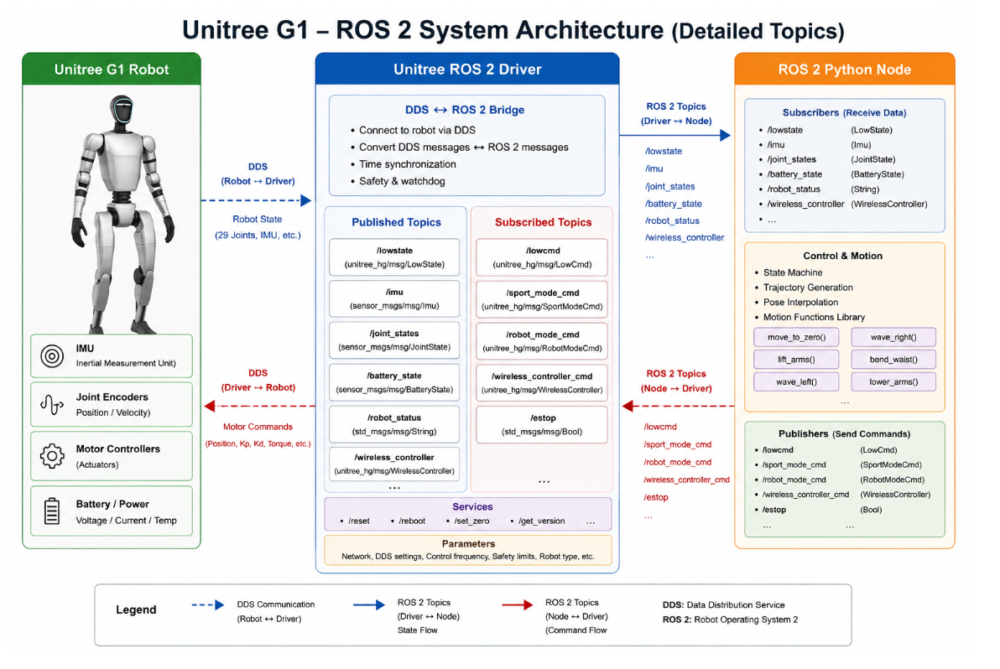

# Module 3: Unitree G1 Programming using Python and ROS 2

# Introduction to Unitree ROS 2 Python

## Introduction

In the previous modules, we learned how to communicate with the Unitree G1 robot using the Unitree Python SDK. The SDK allows developers to directly interact with the robot through DDS (Data Distribution Service), enabling both low-level joint control and high-level locomotion commands.

Although the Python SDK is sufficient for standalone applications, most modern robotics systems are built using the **Robot Operating System 2 (ROS 2)**. ROS 2 provides a standardized framework for integrating perception, navigation, manipulation, artificial intelligence, and robot control into a modular software architecture.

To enable ROS 2 applications to communicate with the Unitree G1 robot, Unitree provides a **ROS 2 Driver**. This driver acts as a bridge between the robot's native DDS communication layer and the ROS 2 ecosystem.

Instead of interacting directly with DDS messages, ROS 2 applications publish and subscribe to familiar ROS 2 topics, allowing developers to build applications using standard ROS 2 tools and APIs.

By the end of this lesson, you will understand how the Unitree ROS 2 Driver works, how ROS 2 topics are mapped to DDS messages, and how Python ROS 2 nodes communicate with the robot.

---

# Learning Objectives

After completing this lesson, you should be able to:

- Explain the architecture of the Unitree ROS 2 Driver.
- Understand the relationship between DDS and ROS 2.
- Identify published and subscribed ROS 2 topics.
- Explain how Python ROS 2 nodes communicate with the robot.
- Understand the role of the DDS ↔ ROS 2 bridge.
- Differentiate between robot state topics and command topics.
- Build a mental model of the complete communication pipeline.

---

# Why Use ROS 2?

The Unitree SDK allows applications to communicate directly with the robot through DDS.

However, most robotics applications require integration with many different software components.

Examples include:

- Cameras
- LiDAR
- SLAM
- Navigation
- Computer Vision
- AI Models
- Speech Recognition
- Motion Planning

ROS 2 provides a common communication framework that allows all these components to exchange information using standardized topics, services, and actions.

Instead of writing custom networking code, developers simply publish and subscribe to ROS 2 topics.

---

# System Architecture Overview



The complete communication system consists of three major components.

```
Unitree Robot

↓

DDS Communication

↓

Unitree ROS 2 Driver

↓

ROS 2 Topics

↓

Python ROS 2 Node

↓

Robot Application
```

The robot never communicates directly with the Python node.

Instead, every message passes through the Unitree ROS 2 Driver.

---

# Understanding the System Components

## Unitree G1 Robot

The Unitree G1 robot contains all of the physical hardware required for sensing and actuation.

Important hardware components include:

- IMU (Inertial Measurement Unit)
- Joint Encoders
- Motor Controllers
- Battery Management System
- Wireless Controller Receiver

These devices continuously generate sensor data.

The robot transmits this information through DDS.

---

## Unitree ROS 2 Driver

The Unitree ROS 2 Driver acts as a communication bridge.

Its responsibilities include:

- Connecting to the robot via DDS
- Receiving robot state messages
- Converting DDS messages into ROS 2 messages
- Publishing ROS 2 topics
- Receiving ROS 2 commands
- Converting ROS 2 messages back into DDS
- Sending commands to the robot

Without the driver, ROS 2 applications cannot communicate with the robot.

---

# DDS ↔ ROS 2 Bridge

The most important component inside the driver is the DDS Bridge.

```
DDS Messages

↓

DDS Bridge

↓

ROS 2 Messages
```

The bridge performs several tasks:

- Message conversion
- Time synchronization
- Safety monitoring
- Communication management

It allows ROS 2 applications to communicate using standard ROS interfaces while hiding the complexity of DDS.

---

# Robot State Topics

The driver publishes robot state information as ROS 2 topics.

Common topics include:

| Topic | Description |
|--------|-------------|
| `/lowstate` | Complete robot state |
| `/imu` | IMU measurements |
| `/joint_states` | Joint positions and velocities |
| `/battery_state` | Battery information |
| `/robot_status` | Robot operating status |
| `/wireless_controller` | Wireless controller input |

Python nodes subscribe to these topics to receive real-time robot information.

---

# Command Topics

ROS 2 nodes publish commands back to the driver.

Common command topics include:

| Topic | Description |
|--------|-------------|
| `/lowcmd` | Low-level motor commands |
| `/sport_mode_cmd` | High-level locomotion commands |
| `/robot_mode_cmd` | Robot mode control |
| `/wireless_controller_cmd` | Controller commands |
| `/estop` | Emergency stop |

The driver converts these ROS 2 messages into DDS packets before sending them to the robot.

---

# Python ROS 2 Node

The ROS 2 Python node contains the application logic.

Typical responsibilities include:

- Reading robot state
- Processing sensor information
- Executing control algorithms
- Generating trajectories
- Publishing robot commands

Unlike the Unitree SDK examples, the ROS 2 node does not communicate directly with DDS.

Instead, it only interacts with ROS 2 topics.

---

# Subscriber Architecture

Python nodes subscribe to robot state topics.

Example subscribers include:

```
/lowstate

↓

LowState Message

↓

Robot State Callback
```

Other commonly used subscribers include:

- `/imu`
- `/joint_states`
- `/battery_state`
- `/robot_status`
- `/wireless_controller`

These callbacks continuously receive updated robot information.

---

# Publisher Architecture

The Python node publishes robot commands.

Typical publishers include:

```
Control Algorithm

↓

LowCmd Message

↓

/lowcmd

↓

ROS 2 Driver

↓

DDS

↓

Robot
```

This architecture separates robot control from communication.

---

# Control and Motion Layer

The control logic usually contains several software modules.

Examples include:

- State Machine
- Trajectory Generator
- Pose Interpolator
- Motion Library

Example functions might include:

```
move_to_zero()

lift_arms()

wave_left()

wave_right()

bend_waist()

lower_arms()
```

These functions generate robot commands that are published through ROS 2.

---

# ROS 2 Communication Flow

The complete communication flow is shown below.

```
Robot Sensors

↓

DDS

↓

Unitree ROS 2 Driver

↓

ROS 2 Topics

↓

Python Node

↓

Motion Algorithm

↓

ROS 2 Commands

↓

Driver

↓

DDS

↓

Robot
```

This loop repeats continuously during robot operation.

---

# Advantages of Using ROS 2

Using ROS 2 provides several important advantages.

### Modular Software

Each software component runs independently.

### Standard Interfaces

Applications communicate through standardized ROS messages.

### Easy Integration

Compatible with:

- Navigation2
- MoveIt 2
- RViz
- Gazebo
- Isaac Sim
- OpenCV
- TensorFlow
- PyTorch

### Scalability

Applications can run across multiple computers.

### Tool Support

ROS 2 includes many powerful development tools including:

- RViz
- rqt
- ros2 topic
- ros2 service
- ros2 bag

---

# When Should You Use the Python SDK?

Use the Unitree Python SDK when:

- Learning the robot
- Creating standalone applications
- Performing hardware testing
- Developing SDK examples

---

# When Should You Use ROS 2?

ROS 2 is recommended when developing:

- Autonomous robots
- AI-powered applications
- Navigation systems
- Manipulation systems
- Multi-node software
- Production robotics applications

---

# Best Practices

- Verify the ROS 2 Driver is running before starting your node.
- Subscribe only to the topics you need.
- Publish commands at an appropriate frequency.
- Test applications in simulation before using hardware.
- Use RViz and `ros2 topic echo` for debugging.

---

# Summary

In this lesson, we introduced the Unitree ROS 2 software architecture and explored how ROS 2 applications communicate with the Unitree G1 robot.

We learned:

- The role of the Unitree ROS 2 Driver
- DDS to ROS 2 message conversion
- Robot state topics
- Command topics
- ROS 2 publishers and subscribers
- Python ROS 2 node architecture
- Complete communication flow

This architecture forms the foundation for all subsequent ROS 2 examples, where Python nodes subscribe to robot state topics, implement control algorithms, and publish commands to the Unitree G1 through the Unitree ROS 2 Driver.