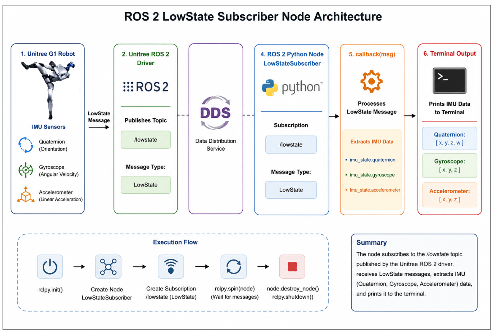

# Module 3: Unitree G1 Programming using Python and ROS 2

# Reading Robot State using ROS 2 Python – Example 1

## Introduction

In the previous lessons, we learned how to communicate with the Unitree G1 robot using the Python SDK. The SDK allows applications to receive robot state information directly through DDS.

In modern robotics systems, however, most applications are built using **ROS 2**, where software components communicate using topics instead of directly accessing the robot through SDK APIs.

This lesson introduces **Reading Robot State using ROS 2 Python**.

Instead of communicating directly with DDS, the application subscribes to the robot's **LowState** topic published by the Unitree ROS 2 Driver. Every time a new robot state message is received, the node displays important sensor information including IMU measurements and joint states.

Unlike the control examples presented later in this module, this application is **read-only**. It never publishes motor commands or changes the robot's behavior. Instead, it serves as a safe diagnostic tool for monitoring the robot in real time.

By the end of this lesson, you will understand how to build a ROS 2 subscriber, receive robot state messages, and interpret the data published by the Unitree G1.

---

# Learning Objectives

After completing this lesson, you should be able to:

- Explain how ROS 2 subscribers work.
- Create a ROS 2 Python node.
- Subscribe to the `lowstate` topic.
- Receive `LowState` messages.
- Read IMU measurements.
- Read joint position, velocity, acceleration, and torque.
- Build a real-time robot monitoring application.

---

# What is Robot State?

The robot continuously measures its internal condition using onboard sensors.

This information is collectively known as the **Robot State**.

Typical robot state information includes:

- IMU orientation
- Joint positions
- Joint velocities
- Joint accelerations
- Estimated motor torque
- Robot operating mode
- Battery information

The Unitree ROS 2 Driver publishes this information so that ROS 2 applications can monitor the robot in real time.

---

# Why Read Robot State?

Robot state information is essential for almost every robotics application.

Examples include:

- Motion control
- Balance control
- Reinforcement learning
- Robot diagnostics
- Motion planning
- Sensor monitoring
- Safety monitoring

Most robot controllers begin by reading the current robot state before generating any control commands.

---

# Running the Example in Simulation

Before running the example, ensure that the Unitree ROS 2 Driver and simulator are already running.

---

## Step 1 – Start the Unitree Simulation

Launch the Unitree G1 simulator and verify that the robot is standing correctly.

---

## Step 2 – Open a New Terminal

Navigate to your ROS 2 workspace.

```bash
cd ~/unitree_ros2_ws
```

---

## Step 3 – Source the Workspace

```bash
source install/setup.bash
```

---

## Step 4 – Run the Subscriber Node

Execute the example.

```bash
ros2 run g1_examples read_robot_state_ros2
```

The terminal should display:

```text
Waiting for LowState messages...
```

Once the Unitree ROS 2 Driver begins publishing data, the robot state is displayed continuously.

---

# Overall System Architecture



```
Unitree G1 Robot

        │

        ▼

Unitree ROS 2 Driver

        │

        ▼

LowState Topic

        │

        ▼

ROS 2 Subscriber

        │

        ▼

LowStateSubscriber Node

        │

        ▼

Display Robot State
```

The node continuously listens to the `lowstate` topic and displays the latest robot state information.

---

# Understanding the ROS 2 Node

The example is implemented by the **LowStateSubscriber** class.

The node performs the following tasks:

- Initializes ROS 2.
- Creates a subscriber.
- Waits for incoming `LowState` messages.
- Executes a callback whenever new data arrives.
- Displays IMU and motor information.

Unlike controller nodes, this application never publishes commands.

---

# ROS 2 Communication

The node subscribes to:

```
/lowstate
```

Message type:

```
unitree_hg/msg/LowState
```

No publishers are created because this example is read-only.

Whenever the robot publishes a new `LowState` message, the callback function is automatically invoked.

---

# Callback Function

The callback is the heart of the application.

Whenever a new message arrives, the callback performs the following operations:

1. Receive the `LowState` message.
2. Read IMU information.
3. Read motor states.
4. Display the received data.

The callback executes automatically for every incoming message.

---

# Reading IMU Data

The example reads several IMU measurements.

### Quaternion

Represents the orientation of the robot.

```
Quaternion

↓

Robot Orientation
```

---

### Gyroscope

Measures the robot's angular velocity.

```
wx

wy

wz
```

These values indicate how quickly the robot is rotating.

---

### Accelerometer

Measures linear acceleration.

```
ax

ay

az
```

These values help determine robot motion and external forces.

---

# Reading Motor State

The `motor_state` array contains information for every joint.

Each motor provides:

| Parameter | Description |
|------------|-------------|
| `q` | Joint position (rad) |
| `dq` | Joint velocity (rad/s) |
| `ddq` | Joint acceleration (rad/s²) |
| `tau_est` | Estimated joint torque (Nm) |

The node prints the information for every motor.

Example:

```
Idx     q(rad)    dq(rad/s)    ddq(rad/s²)    tau_est(Nm)

00      0.12       0.00          0.02           1.52

01     -0.05       0.01          0.01           0.83
```

This information is useful for diagnostics and controller development.

---

# Program Workflow

The node follows the sequence below.

```
Start ROS 2

↓

Create Subscriber

↓

Wait for LowState Message

↓

Receive Message

↓

Execute Callback

↓

Display IMU Data

↓

Display Motor Data

↓

Wait for Next Message
```

This process repeats continuously until the node is stopped.

---

# Understanding the LowState Message

The `LowState` message contains information describing the current condition of the robot.

Important fields include:

- IMU state
- Motor state array
- Machine mode
- Sensor information
- Reserved status fields

The example focuses on the IMU and motor state data, which are the most commonly used fields when developing controllers.

---

# Safety Considerations

This example is completely **read-only**.

It:

- Does **not** publish commands.
- Does **not** move the robot.
- Does **not** modify any robot state.

Because it only subscribes to the `lowstate` topic, it is safe to run on both the simulator and a physical robot.

---

# Best Practices

- Verify that the Unitree ROS 2 Driver is running.
- Confirm that the `lowstate` topic is available using `ros2 topic list`.
- Use `ros2 topic echo /lowstate` to inspect raw messages.
- Avoid excessive console printing in high-frequency applications.
- Build controllers only after verifying that robot state data is being received correctly.

---

# Summary

In this lesson, we learned how to read the Unitree G1 robot state using ROS 2 Python.

We explored:

- ROS 2 subscribers
- The `LowState` topic
- IMU data
- Joint state information
- Callback functions
- Real-time robot monitoring

This example provides the foundation for the next lessons, where we will use the received robot state to generate low-level motor commands and implement closed-loop robot controllers using ROS 2.