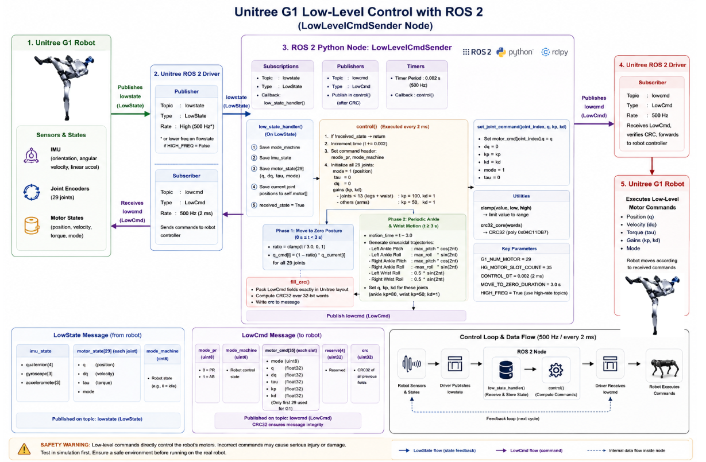

# Module 3: Unitree G1 Programming using Python and ROS 2

# Low-Level Joint Control using ROS 2 Python – Example 1

## Introduction

In the previous lessons, we learned how to control the Unitree G1 robot using the Unitree Python SDK. The SDK communicates directly with the robot through DDS, allowing applications to publish low-level motor commands and receive robot state information.

While the SDK is suitable for standalone applications, most modern robotics software is developed using **ROS 2**. ROS 2 provides a modular communication framework where different software components exchange information using publishers and subscribers.

This lesson introduces **Low-Level Joint Control using ROS 2 Python**.

Instead of communicating directly through the SDK, the controller is implemented as a ROS 2 node. The node subscribes to the robot's **LowState** topic, processes the latest robot state, generates motor commands, and publishes **LowCmd** messages back to the robot.

The example demonstrates a complete real-time control loop running at **500 Hz**. During the first three seconds, every joint is smoothly moved toward the zero posture. After reaching the neutral configuration, the controller generates a sinusoidal motion for both ankle joints and wrist-roll joints.

By the end of this lesson, you will understand how to build a real-time low-level controller using ROS 2 Python for the Unitree G1 robot.

---

# Learning Objectives

After completing this lesson, you should be able to:

- Explain low-level control using ROS 2.
- Create a ROS 2 node in Python.
- Subscribe to the `lowstate` topic.
- Publish `lowcmd` messages.
- Build a real-time control loop.
- Generate joint trajectories using interpolation.
- Produce sinusoidal joint motion.
- Calculate and publish CRC-protected command packets.

---

# What is Low-Level Joint Control?

Low-level control gives the application complete authority over the robot's actuators.

Instead of requesting behaviors such as:

> Walk Forward

or

> Stand

the controller directly commands each motor.

Each joint receives commands including:

- Desired Position (`q`)
- Desired Velocity (`dq`)
- Feed-forward Torque (`tau`)
- Proportional Gain (`KP`)
- Derivative Gain (`KD`)

These commands are continuously transmitted to the robot at a high frequency.

---

# Why Use ROS 2 for Low-Level Control?

ROS 2 allows the controller to become part of a larger robotics application.

Advantages include:

- Standard ROS interfaces
- Easy integration with perception systems
- Multi-node architecture
- Visualization using RViz
- Recording using rosbag
- Easy debugging with ROS tools

The robot can now interact with navigation, AI, SLAM, and computer vision nodes.

---

# Running the Example in Simulation

Before running the controller, ensure that the Unitree ROS 2 Driver and simulator are already running.

---

## Step 1 – Start the Unitree Simulation

Launch the Unitree G1 simulator and verify that the robot is standing correctly.

---

## Step 2 – Open a New Terminal

Navigate to the ROS 2 workspace.

```bash
cd ~/unitree_ros2_ws
```

---

## Step 3 – Source the Workspace

```bash
source install/setup.bash
```

---

## Step 4 – Run the Controller

```bash
ros2 run g1_examples low_level_ros2_example_1
```

The terminal should display:

```text
low_level_cmd_sender ready.
Waiting for low state...
```

Once the first robot state is received, the controller automatically begins generating commands.

---

# Overall Controller Architecture



```
LowState Topic

        │

        ▼

ROS 2 Subscriber

        │

        ▼

LowLevelCmdSender Node

        │

        ▼

State Machine

        │

        ▼

Trajectory Generator

        │

        ▼

LowCmd Message

        │

        ▼

CRC Calculation

        │

        ▼

ROS 2 Publisher

        │

        ▼

Robot
```

The node continuously receives robot state information, computes the desired joint positions, and publishes low-level commands.

---

# Motion Sequence

The demonstration consists of two stages.

## Stage 1 – Move to Zero Pose

Duration:

**3 seconds**

Every joint is smoothly interpolated from its measured position to the zero posture.

Advantages:

- Smooth initialization
- Stable startup
- Predictable robot configuration

---

## Stage 2 – Sinusoidal Motion

After reaching the zero posture, the controller continuously generates sinusoidal trajectories.

The following joints are commanded:

- Left Ankle Pitch
- Left Ankle Roll
- Right Ankle Pitch
- Right Ankle Roll
- Left Wrist Roll
- Right Wrist Roll

The ankle joints move with mirrored trajectories while both wrists rotate together.

---

# Understanding the ROS 2 Node

The controller is implemented by the **LowLevelCmdSender** class.

The node performs the following tasks:

- Creates a subscriber
- Creates a publisher
- Creates a 500 Hz timer
- Receives robot state
- Computes joint commands
- Publishes LowCmd messages

Unlike the SDK examples, communication is performed entirely through ROS 2 topics.

---

# ROS 2 Communication

The node subscribes to:

```
lowstate
```

Message type:

```
unitree_hg/msg/LowState
```

The node publishes:

```
lowcmd
```

Message type:

```
unitree_hg/msg/LowCmd
```

This communication loop runs continuously throughout the execution of the controller.

---

# Real-Time Control Loop

The controller uses a ROS 2 timer running at:

```
500 Hz
```

or

```
2 ms
```

Each iteration performs the following operations:

1. Read robot state
2. Update trajectory time
3. Generate desired joint positions
4. Fill LowCmd message
5. Compute CRC
6. Publish command

This loop repeats continuously while the node is running.

---

# Trajectory Generation

During startup, the controller performs linear interpolation.

```
Current Position

↓

Interpolation

↓

Zero Position
```

The interpolation ratio gradually increases from **0.0** to **1.0** over three seconds.

---

# Sinusoidal Motion

Once initialization completes, the controller generates periodic motion using sine and cosine functions.

```
Left Ankle Pitch

↓

Cosine Wave

Right Ankle Roll

↓

Negative Sine Wave

Left Wrist Roll

↓

Sine Wave
```

This creates smooth, continuous ankle and wrist movement.

---

# Position Controller

Each motor command contains:

- Position (`q`)
- Velocity (`dq`)
- Torque (`tau`)
- Proportional Gain (`KP`)
- Derivative Gain (`KD`)

Different gain values are used for leg joints and upper-body joints to achieve stable control.

---

# CRC Generation

Before every command is published, the controller computes a CRC checksum.

The robot verifies this checksum before accepting the packet.

This mechanism prevents corrupted commands from reaching the hardware.

---

# Safety Considerations

Before running this example:

- Test in simulation first.
- Ensure the robot is standing.
- Keep people away from the robot.
- Verify the ROS 2 Driver is running.
- Verify the `lowstate` topic is being received.

Low-level commands directly control the robot's actuators and should always be tested carefully.

---

# Best Practices

- Wait until a valid robot state has been received before publishing commands.
- Reuse command messages to reduce memory allocation.
- Keep the control loop deterministic.
- Use interpolation for smooth startup.
- Validate the CRC before publishing.

---

# Summary

In this lesson, we implemented a complete low-level controller using ROS 2 Python.

We learned:

- ROS 2 publishers and subscribers
- LowState messages
- LowCmd messages
- Real-time control loops
- Joint interpolation
- Sinusoidal trajectory generation
- CRC generation
- Safe low-level robot control

This example forms the foundation for more advanced ROS 2 controllers that combine robot sensing, perception, and intelligent motion planning with direct motor control.