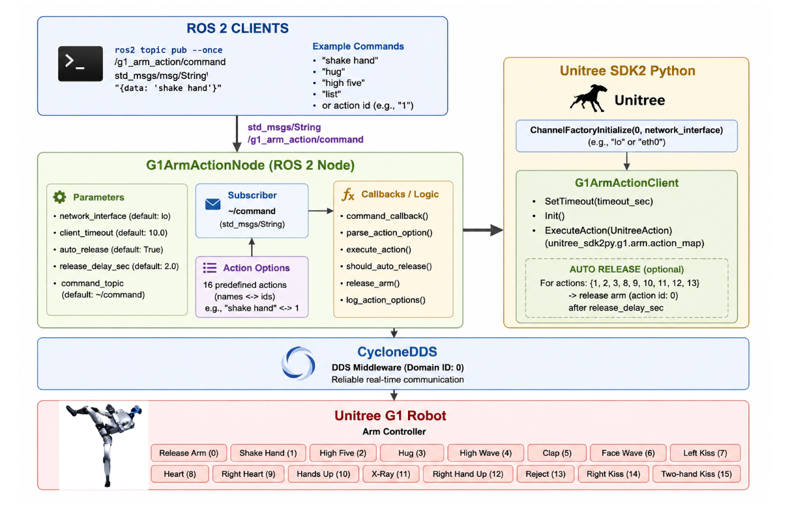

# Module 3: Unitree G1 Programming using Python and ROS 2

# High-Level Arm Control using ROS 2 Python – Example 1

## Introduction

In the previous lessons, we explored how to control the Unitree G1 using low-level motor commands. Low-level control provides direct access to every actuator, allowing developers to implement custom motion controllers and advanced robotics algorithms.

However, many applications only require predefined robot gestures such as handshakes, waving, clapping, or raising the arms. Implementing these behaviors manually using low-level joint commands is time-consuming and unnecessary.

To simplify application development, the Unitree SDK provides a **High-Level Arm Action API**. Instead of commanding individual joints, developers simply request a predefined arm action using the **G1ArmActionClient**.

This example integrates the Unitree High-Level Arm API with ROS 2. A ROS 2 node subscribes to a command topic and executes the requested arm action whenever a message is received.

By using ROS 2 topics instead of keyboard input, the robot can easily be integrated into larger robotics systems including perception, navigation, voice assistants, and AI applications.

By the end of this lesson, you will understand how to control the Unitree G1 upper body using predefined arm actions through ROS 2.

---

# Learning Objectives

After completing this lesson, you should be able to:

- Explain the purpose of high-level arm actions.
- Initialize the Unitree High-Level Arm SDK.
- Configure DDS communication.
- Create a ROS 2 node using Python.
- Subscribe to ROS 2 command topics.
- Execute predefined arm gestures.
- Automatically release arm control after selected actions.
- Integrate arm actions into larger ROS 2 applications.

---

# Running the Example in Simulation

Before running the program, ensure that the Unitree G1 simulator is already running and publishing DDS topics.

## Step 1 – Start the Unitree G1 Simulation

Launch the Unitree MuJoCo simulator following the setup instructions provided in the previous lesson.

Verify that the robot is standing correctly before continuing.

---

## Step 2 – Open a New Terminal

Navigate to the example directory.

```bash
cd ~/ROS2/examples_unitree_python_sdk
```

---

## Step 3 – Run the ROS 2 Node

Execute the program.

```bash
python3 high_level_ros2_example_1.py
```

The default network interface is:

```
lo
```

which is suitable for local simulation.

The terminal should display:

```text
Using network interface 'lo'

G1 arm action node ready...
```

---

## Step 4 – Publish an Arm Action

Open another terminal and publish a command.

Example:

```bash
ros2 topic pub --once /g1_arm_action/command std_msgs/msg/String \
"{data: 'shake hand'}"
```

The robot should execute the handshake motion.

---

# Running on Real Hardware

To communicate with a physical Unitree G1 robot, specify the robot's Ethernet interface.

Example:

```bash
python3 high_level_ros2_example_1.py --ros-args \
-p network_interface:=eth0
```

Replace **eth0** with the correct network interface connected to the robot.

---

# Overall System Architecture



```
ROS 2 Command Topic

        │

        ▼

ROS 2 Subscriber

        │

        ▼

Command Callback

        │

        ▼

Parse Requested Action

        │

        ▼

G1ArmActionClient

        │

        ▼

Unitree SDK

        │

        ▼

DDS Communication

        │

        ▼

Unitree G1 Robot
```

The controller continuously waits for ROS 2 messages. Whenever a valid command is received, the corresponding Unitree arm action is executed.

---

# Supported Arm Actions

The example supports multiple predefined gestures.

| Action | Description |
|---------|-------------|
| Release Arm | Release SDK control |
| Shake Hand | Perform handshake |
| High Five | High-five gesture |
| Hug | Hugging motion |
| High Wave | Wave above the head |
| Clap | Clap both hands |
| Face Wave | Wave near the face |
| Left Kiss | Left-side kiss gesture |
| Heart | Heart gesture |
| Right Heart | Right-hand heart |
| Hands Up | Raise both hands |
| X-Ray | Cross-arm pose |
| Right Hand Up | Raise the right arm |
| Reject | Stop/reject gesture |
| Right Kiss | Right-side kiss gesture |
| Two-Hand Kiss | Two-handed kiss gesture |

---

# Understanding the ROS 2 Node

The node is implemented using the `G1ArmActionNode` class.

The controller performs the following tasks:

- Initializes DDS communication.
- Creates the G1ArmActionClient.
- Subscribes to a ROS 2 command topic.
- Parses incoming commands.
- Executes predefined arm actions.
- Automatically releases the arm when required.

Unlike low-level controllers, this node does not generate joint trajectories.

Instead, all motion planning is performed internally by the Unitree SDK.

---

# ROS 2 Communication Flow

The node subscribes to:

```
/g1_arm_action/command
```

Message type:

```
std_msgs/String
```

Example commands include:

```
shake hand
```

```
high five
```

```
hug
```

```
clap
```

Whenever a message is received, the callback function validates the command and invokes the corresponding Unitree API.

---

# Automatic Arm Release

Certain arm actions temporarily take control of the robot's upper body.

After these actions complete, the controller automatically executes the **Release Arm** action.

Benefits include:

- Returns the robot to a relaxed state.
- Prevents unnecessary arm stiffness.
- Matches the behavior of the original Unitree example.
- Improves safety when chaining multiple actions.

The automatic release behavior can be enabled or disabled using the `auto_release` ROS parameter.

---

# ROS 2 Parameters

The example provides several configurable parameters.

| Parameter | Description |
|-----------|-------------|
| `network_interface` | DDS network interface |
| `command_topic` | ROS topic used for commands |
| `client_timeout` | SDK communication timeout |
| `auto_release` | Automatically release the arm after supported actions |
| `release_delay_sec` | Delay before releasing the arm |

These parameters allow the same node to be reused in different robot configurations.

---

# Safety Considerations

Before executing arm actions:

- Ensure there is sufficient space around the robot.
- Keep people away from the robot's workspace.
- Test new applications in simulation first.
- Verify DDS communication before sending commands.

High-level actions can execute quickly and may continue briefly after the command has been sent.

---

# Summary

In this lesson, we learned how to control the Unitree G1 upper body using the High-Level Arm Action API integrated with ROS 2.

We explored:

- High-level arm control
- ROS 2 topic subscriptions
- DDS initialization
- G1ArmActionClient
- Command parsing
- Automatic arm release
- ROS parameters
- Safe execution of predefined robot gestures

Using the High-Level Arm SDK allows developers to execute complex arm motions with only a few API calls, making it ideal for service robots, human-robot interaction, demonstrations, and ROS 2 application development.