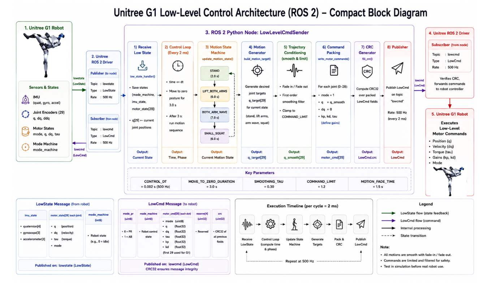

# Module 3: Unitree G1 Programming using Python and ROS 2

# Low-Level Joint Control using ROS 2 Python – Example 2

## Introduction

In the previous lesson, we developed a basic low-level ROS 2 controller that smoothly moved the Unitree G1 robot to a neutral posture before generating simple sinusoidal joint motions.

This lesson expands upon those concepts by introducing a **multi-stage motion controller** capable of executing a complete demonstration sequence.

Instead of controlling only a few joints, this example combines multiple predefined motions—including standing, lifting both arms, waving, and performing a small squat—into a continuous choreography. Each motion is generated using smooth interpolation techniques and blended together through a state machine to eliminate abrupt transitions.

The controller is implemented as a ROS 2 node that subscribes to the robot's **LowState** topic, computes the desired joint trajectories, generates **LowCmd** messages, calculates the required CRC checksum, and publishes commands at **500 Hz**.

By the end of this lesson, you will understand how to implement a reusable low-level motion controller using ROS 2 Python that supports multiple robot behaviors through state-machine-based motion planning.

---

# Learning Objectives

After completing this lesson, you should be able to:

- Explain the architecture of a multi-stage low-level controller.
- Create a ROS 2 controller node.
- Subscribe to robot state information.
- Publish LowCmd messages.
- Implement a motion state machine.
- Generate reusable robot poses.
- Blend multiple robot motions smoothly.
- Apply low-pass filtering to joint commands.
- Generate CRC-protected command packets.
- Build continuous robot demonstrations using ROS 2.

---

# What is a Motion State Machine?

Rather than generating only one robot motion, a motion state machine organizes several robot behaviors into independent states.

Each state defines a particular robot motion.

Examples include:

- Standing
- Raising both arms
- Waving
- Squatting

The controller automatically transitions between these states after a specified duration, creating a complete demonstration sequence.

---

# Why Use a Motion State Machine?

Motion state machines make robot applications easier to organize.

Advantages include:

- Modular controller design
- Reusable motion primitives
- Smooth transitions
- Easy debugging
- Simple extension with new motions

Instead of writing one large controller, each behavior is implemented independently.

---

# Running the Example in Simulation

Before running the controller, ensure that the Unitree ROS 2 Driver and MuJoCo simulator are already running.

---

## Step 1 – Start the Unitree Simulation

Launch the Unitree G1 simulator and verify that the robot is standing correctly.

---

## Step 2 – Open a New Terminal

Navigate to your ROS 2 workspace.

```bash
cd ~/unitree_ros2_ws
```

---

## Step 3 – Source the Workspace

```bash
source install/setup.bash
```

---

## Step 4 – Run the Controller

Execute the example.

```bash
ros2 run g1_examples low_level_ros2_example_2
```

The terminal displays:

```text
low_level_cmd_sender ready.

Waiting for low state...

Moving to zero posture...
```

After initialization, the robot automatically begins the demonstration sequence.

---

# Overall Controller Architecture



```
LowState Topic

        │

        ▼

ROS 2 Subscriber

        │

        ▼

LowLevelCmdSender

        │

        ▼

Motion State Machine

        │

        ▼

Pose Generator

        │

        ▼

Motion Filter

        │

        ▼

LowCmd Message

        │

        ▼

CRC Generation

        │

        ▼

ROS 2 Publisher

        │

        ▼

Robot
```

The controller continuously receives robot state information, computes the desired robot pose, filters the commands, calculates the CRC checksum, and publishes motor commands.

---

# Motion Sequence

The demonstration consists of five stages.

## Stage 1 – Move to Zero Pose

Duration:

**3 seconds**

The controller smoothly moves every joint toward the neutral posture.

Purpose:

- Safe initialization
- Smooth startup
- Predictable robot configuration

---

## Stage 2 – Standing Pose

Duration:

**2 seconds**

The robot remains in its neutral standing posture.

This stage serves as the reference position before executing the demonstration.

---

## Stage 3 – Lift Both Arms

Duration:

**6 seconds**

The controller gradually raises both arms.

The following joints move:

- Left Shoulder Pitch
- Left Shoulder Roll
- Left Elbow
- Right Shoulder Pitch
- Right Shoulder Roll
- Right Elbow

---

## Stage 4 – Double Arm Wave

Duration:

**7 seconds**

Both arms perform synchronized waving motions.

The controller generates sinusoidal trajectories that smoothly move:

- Shoulders
- Elbows
- Wrist Roll joints

The waving motion is blended using a fade envelope to avoid abrupt movement.

---

## Stage 5 – Small Squat

Duration:

**6 seconds**

The robot performs a gentle squat.

The following joints participate:

- Hip Pitch
- Knee
- Ankle Pitch

After the squat, the controller automatically returns to the standing state and repeats the sequence.

---

# Motion State Machine

The controller defines four motion states.

| State | Description |
|---------|-------------|
| STAND | Neutral posture |
| LIFT_BOTH_ARMS | Raise both arms |
| BOTH_ARM_WAVE | Perform synchronized waving |
| SMALL_SQUAT | Bend both legs slightly |

Each state executes for a predefined duration before automatically transitioning to the next state.

---

# Understanding the ROS 2 Node

The controller is implemented by the **LowLevelCmdSender** class.

The node performs the following tasks:

- Creates a subscriber.
- Creates a publisher.
- Starts a 500 Hz timer.
- Receives LowState messages.
- Generates robot poses.
- Smooths joint commands.
- Publishes LowCmd messages.

The ROS 2 timer continuously executes the control loop.

---

# ROS 2 Communication

The node subscribes to:

```
lowstate
```

Message type:

```
unitree_hg/msg/LowState
```

The node publishes:

```
lowcmd
```

Message type:

```
unitree_hg/msg/LowCmd
```

The communication loop executes continuously while the controller is running.

---

# Real-Time Control Loop

The controller executes every

```
2 ms
```

which corresponds to

```
500 Hz
```

Each iteration performs the following operations:

1. Receive robot state.
2. Update controller time.
3. Select active motion state.
4. Generate target joint positions.
5. Apply motion filtering.
6. Populate the LowCmd message.
7. Compute the CRC checksum.
8. Publish motor commands.

---

# Pose Generation

The controller generates several reusable poses.

These include:

- Stand
- Lift Both Arms
- Both Arm Wave
- Small Squat

Each pose modifies only the required joints while the remaining joints stay near the neutral position.

---

# Motion Blending

Rather than switching immediately between poses, the controller blends motions smoothly.

The controller uses:

- SmoothStep interpolation
- Fade-in
- Fade-out

Benefits include:

- Smooth acceleration
- Smooth deceleration
- Reduced joint oscillation
- More natural robot motion

---

# Command Filtering

Before publishing commands, the controller applies a first-order low-pass filter.

Advantages:

- Removes discontinuities
- Prevents sudden joint movement
- Produces smoother trajectories
- Improves hardware safety

Each joint gradually approaches its target position rather than jumping directly to it.

---

# Position Controller

Every motor command contains:

- Desired Position (`q`)
- Desired Velocity (`dq`)
- Feed-forward Torque (`tau`)
- Proportional Gain (`KP`)
- Derivative Gain (`KD`)

Different KP gains are used for:

- Leg joints
- Ankle joints
- Upper-body joints

This allows different parts of the robot to have appropriate stiffness.

---

# CRC Generation

Before publishing each command, the controller computes a CRC checksum.

The checksum allows the robot to verify that the received command packet has not been corrupted during communication.

Only valid packets are accepted by the robot.

---

# Safety Considerations

Before running this example:

- Always test the controller in simulation.
- Verify the robot is standing correctly.
- Ensure the ROS 2 Driver is running.
- Keep people away from the robot.
- Monitor joint motion before deploying to hardware.

Because this example directly controls every joint, incorrect commands may result in unstable robot behavior.

---

# Best Practices

- Wait for a valid LowState message before publishing commands.
- Initialize the robot smoothly.
- Use interpolation between motion states.
- Apply low-pass filtering to every joint.
- Validate CRC values before transmission.
- Organize complex behaviors using state machines.

---

# Summary

In this lesson, we implemented an advanced low-level controller using ROS 2 Python.

We explored:

- ROS 2 publishers and subscribers
- Motion state machines
- Multi-stage choreography
- SmoothStep interpolation
- Motion blending
- Low-pass command filtering
- Position control
- CRC generation
- Safe low-level robot programming

This example demonstrates how complex robot behaviors can be built by combining reusable motion primitives, smooth trajectory generation, and real-time control. It forms the foundation for creating sophisticated humanoid robot applications using ROS 2 and the Unitree G1 platform.