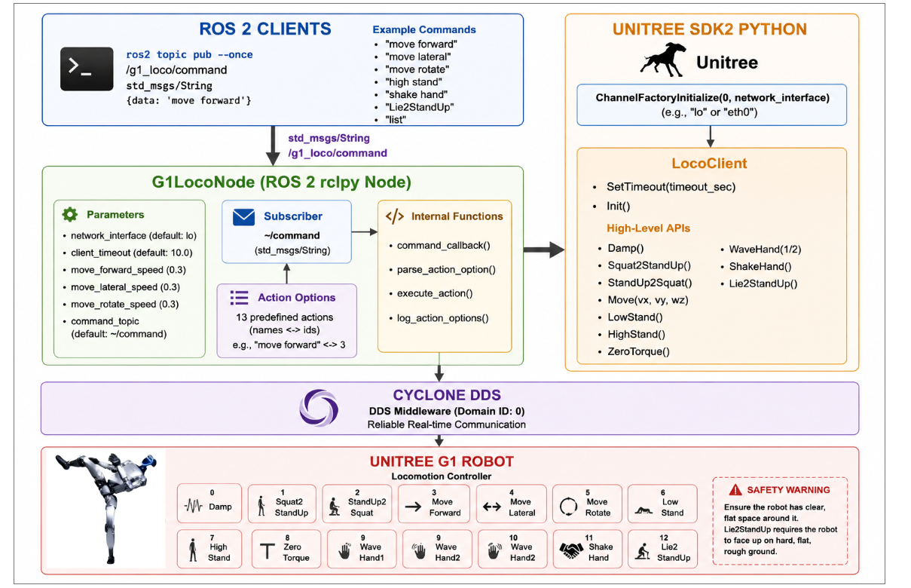

# Module 3: Unitree G1 Programming using Python and ROS 2

# High-Level Locomotion Control using ROS 2 Python – Example 2

## Introduction

In the previous lessons, we explored how to control the Unitree G1 robot using the High-Level Locomotion SDK through a terminal-based interface. While the terminal interface is useful for testing individual robot actions, it is not suitable for larger robotics applications where multiple software components need to communicate with each other.

ROS 2 provides a standardized communication framework that allows different nodes to exchange information through topics, services, and actions. By integrating the Unitree High-Level Locomotion SDK with ROS 2, locomotion commands can be generated by navigation systems, AI applications, voice assistants, vision algorithms, or any other ROS 2 node.

This lesson demonstrates **High-Level Locomotion Control using ROS 2 Python**.

Instead of reading commands from the keyboard, the application subscribes to a ROS 2 command topic. Whenever a locomotion command is published, the node validates the request and executes the corresponding high-level locomotion behavior using the **LocoClient** provided by the Unitree SDK.

Unlike low-level control, developers never generate joint trajectories or motor commands. The Unitree locomotion controller handles all balancing, gait generation, and motion planning internally.

By the end of this lesson, you will understand how to integrate the Unitree High-Level Locomotion SDK into ROS 2 applications and execute predefined robot motions through ROS topics.

---

# Learning Objectives

After completing this lesson, you should be able to:

- Explain the purpose of the High-Level Locomotion SDK.
- Initialize DDS communication.
- Configure the Unitree LocoClient.
- Create a ROS 2 Python node.
- Subscribe to locomotion command topics.
- Execute predefined locomotion behaviors.
- Configure locomotion parameters.
- Integrate locomotion control into larger ROS 2 systems.

---

# Running the Example in Simulation

Before running the program, ensure that the Unitree G1 MuJoCo simulator and the Unitree ROS 2 Driver are already running.

## Step 1 – Start the Unitree G1 Simulation

Launch the Unitree MuJoCo simulator and verify that the robot is standing correctly.

---

## Step 2 – Open a New Terminal

Navigate to your ROS 2 workspace.

```bash
cd ~/unitree_ros2_ws
```

---

## Step 3 – Source the Workspace

```bash
source install/setup.bash
```

---

## Step 4 – Run the ROS 2 Node

Execute the program.

```bash
ros2 run g1_examples high_level_ros2_example_2
```

The default network interface is:

```
lo
```

which is appropriate for local simulation.

The terminal should display:

```text
Using network interface 'lo'

G1 locomotion node ready...
```

---

## Step 5 – Publish a Locomotion Command

Open another terminal.

Publish a command to the locomotion topic.

Example:

```bash
ros2 topic pub --once /g1_loco/command std_msgs/msg/String \
"{data: 'move forward'}"
```

The robot immediately begins walking forward.

Other examples include:

```bash
ros2 topic pub --once /g1_loco/command std_msgs/msg/String \
"{data: 'move rotate'}"
```

```bash
ros2 topic pub --once /g1_loco/command std_msgs/msg/String \
"{data: 'wave hand1'}"
```

---

# Running on Real Hardware

To communicate with a physical Unitree G1 robot, specify the Ethernet interface connected to the robot.

Example:

```bash
ros2 run g1_examples high_level_ros2_example_2 \
--ros-args -p network_interface:=eth0
```

Replace **eth0** with the appropriate network interface on your computer.

Before running the robot:

- Verify DDS communication.
- Ensure sufficient free space around the robot.
- Test applications in simulation before deployment.

---

# Overall System Architecture



```
ROS 2 Command Topic

        │

        ▼

ROS 2 Subscriber

        │

        ▼

Command Callback

        │

        ▼

Command Parser

        │

        ▼

LocoClient

        │

        ▼

Unitree SDK

        │

        ▼

DDS Communication

        │

        ▼

Unitree G1 Robot
```

The node continuously waits for ROS 2 messages. Whenever a valid locomotion command is received, the corresponding Unitree SDK function is executed.

---

# Supported Locomotion Actions

The example supports several predefined locomotion behaviors.

| ID | Action | Description |
|----|---------|-------------|
| 0 | Damp | Enable damping mode |
| 1 | Squat2StandUp | Stand up from a squat position |
| 2 | StandUp2Squat | Move from standing to squat |
| 3 | Move Forward | Walk forward |
| 4 | Move Lateral | Walk sideways |
| 5 | Move Rotate | Rotate in place |
| 6 | Low Stand | Lower standing posture |
| 7 | High Stand | Normal standing posture |
| 8 | Zero Torque | Disable motor torque |
| 9 | Wave Hand 1 | Wave without turning |
| 10 | Wave Hand 2 | Wave while turning |
| 11 | Shake Hand | Perform handshake |
| 12 | Lie2StandUp | Recover from lying position |

The node accepts either the action name or the numerical action ID.

---

# Understanding the ROS 2 Node

The node is implemented using the `G1LocoNode` class.

The controller performs the following tasks:

- Initializes DDS communication.
- Creates the `LocoClient`.
- Declares configurable ROS 2 parameters.
- Subscribes to the locomotion command topic.
- Parses incoming commands.
- Executes the requested locomotion behavior.

Unlike low-level controllers, this node never generates motor trajectories or computes joint positions.

Instead, all locomotion planning is performed internally by the Unitree controller.

---

# ROS 2 Communication Flow

The node subscribes to:

```
/g1_loco/command
```

Message type:

```
std_msgs/String
```

Example commands include:

```
move forward
```

```
move rotate
```

```
wave hand1
```

```
shake hand
```

```
low stand
```

```
high stand
```

Whenever a message is received, the callback validates the command and executes the corresponding SDK function.

---

# Command Parsing

The controller supports two methods of selecting an action.

### Action Name

```
move forward
```

↓

```
Action ID = 3
```

↓

```
LocoClient.Move()
```

### Action ID

```
3
```

↓

```
LocoClient.Move()
```

Both methods produce identical robot behavior.

---

# ROS 2 Parameters

The node exposes several configurable parameters.

| Parameter | Description |
|-----------|-------------|
| `network_interface` | DDS network interface |
| `command_topic` | ROS topic used for commands |
| `client_timeout` | SDK communication timeout |
| `move_forward_speed` | Forward walking speed |
| `move_lateral_speed` | Sideways walking speed |
| `move_rotate_speed` | Rotational speed |

These parameters allow the controller to be adapted for different robot configurations without modifying the source code.

---

# Locomotion Speed Configuration

Walking commands use configurable speed parameters.

Examples:

```
Move(vx, 0, 0)
```

Forward motion.

```
Move(0, vy, 0)
```

Lateral motion.

```
Move(0, 0, ω)
```

Rotation.

The default speed is **0.3 m/s** (or **0.3 rad/s** for rotation), but these values can be adjusted using ROS 2 parameters.

---

# Safety Considerations

Before executing locomotion commands:

- Verify the robot is standing correctly.
- Ensure the workspace is clear of obstacles.
- Keep people away from the robot.
- Test new applications in simulation first.
- Confirm DDS communication before sending commands.

Some actions, such as **Lie2StandUp**, require specific initial robot configurations and should only be executed under the appropriate conditions.

---

# Best Practices

- Initialize DDS before creating the `LocoClient`.
- Verify the network interface before starting the node.
- Use ROS 2 parameters instead of modifying source code.
- Validate commands before execution.
- Use descriptive command names for readability.
- Test all locomotion behaviors in simulation before deploying to hardware.

---

# Summary

In this lesson, we learned how to control the Unitree G1 using the High-Level Locomotion SDK integrated with ROS 2.

We explored:

- High-level locomotion control
- ROS 2 topic subscriptions
- DDS initialization
- LocoClient
- Command parsing
- Configurable locomotion speeds
- ROS 2 parameters
- Safe execution of predefined locomotion behaviors

By exposing the Unitree High-Level SDK through ROS 2 topics, this example enables seamless integration with navigation, perception, AI, and autonomous robotics applications while keeping locomotion control simple, modular, and easy to extend.